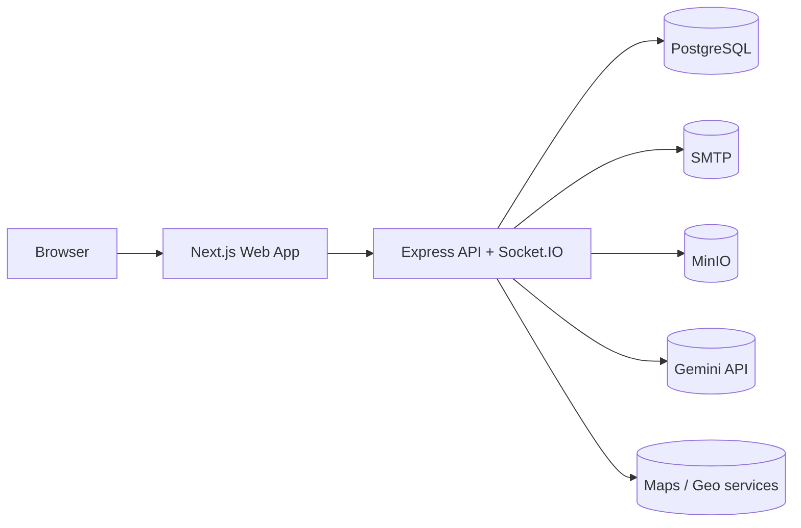
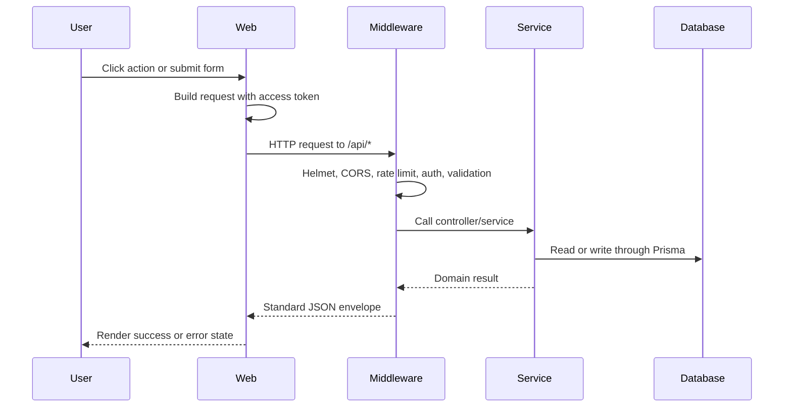
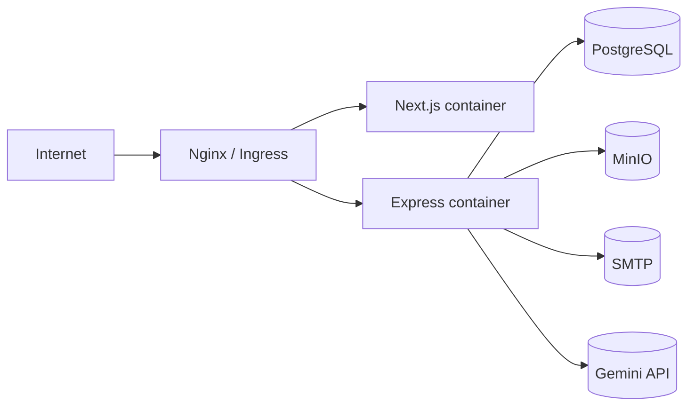

# Architecture

RakshaAI technical architecture reference for the current repository state.

Source of truth:
- `apps/backend/src/`
- `apps/web/src/`
- `prisma/schema.prisma`
- `docker/`
- `apps/backend/Dockerfile`
- `apps/web/Dockerfile`

Related docs:
- [API.md](API.md)
- [BackendSchema.md](BackendSchema.md)
- [Deployment.md](DEPLOYMENT.md)
- [Implementation.md](Implementation.md)
- [TRD.md](TRD.md)

## 1. System Overview

RakshaAI is a monorepo safety platform with a web client and a single backend service. The architecture prioritizes:

- fast alert creation
- strong role-based access control
- realtime status propagation
- operational clarity for responders
- separation between UI, transport, domain logic, and persistence

## 2. High-Level Architecture

| Layer | Responsibility | Key files |
|---|---|---|
| Browser / presentation | Pages, forms, dashboards, routing, client state | `apps/web/src/app`, `apps/web/src/components`, `apps/web/src/hooks` |
| Transport / API | REST, auth, validation, realtime rooms, rate limits | `apps/backend/src/routes`, `controllers`, `middleware`, `sockets` |
| Domain services | Alerts, organizations, dashboards, AI, community, maps | `apps/backend/src/services` |
| Persistence | Data model, migration history, seeds | `prisma/schema.prisma`, `prisma/migrations`, `prisma/seed.ts` |
| Integrations | SMTP, storage, maps, AI | `apps/backend/src/config`, `services` |

### Dependency Direction

- Web depends on backend APIs and Socket.IO.
- Backend depends on Prisma and external services.
- Domain services should not depend on the web app.
- Docs should never be imported by runtime code.

## 3. Request Lifecycle

## 4. Module Breakdown

### Web Modules

- `app/`: route pages and layouts
- `components/`: reusable UI, layout shells, and maps
- `hooks/`: socket and geolocation hooks
- `lib/`: API client, route helpers, motion helpers, geometry helpers
- `store/`: auth/session state

### Backend Modules

- `routes/`: HTTP route registration
- `controllers/`: request handlers
- `services/`: business logic
- `middleware/`: auth, validation, rate limiting, error handling
- `config/`: environment, database, logging, mailer
- `sockets/`: realtime room setup and emitters
- `utils/`: response helpers, sanitization, async wrappers

## 5. Data Architecture

The schema is relational and uses:

- UUID primary keys
- explicit relations and foreign keys
- soft lifecycle flags rather than hard deletes in many flows
- audit and history tables for safety-critical events

Migration strategy:

- Prisma migrations are the source of schema history.
- `prisma migrate deploy` runs in production start flows.
- `prisma migrate dev` is used locally.

## 6. Authentication and Authorization Architecture

Authentication model:

- JWT access token in `Authorization` header
- HttpOnly refresh-token cookie
- optional browser persistence for session restoration
- database-backed user lookup on each authenticated request

Authorization model:

- route-level middleware checks role membership
- special guards exist for superadmin, department, NGO, volunteer, policeman, and mixed admin paths
- the frontend mirrors role checks for navigation and page redirect UX, but the backend remains the enforcement point

## 7. Storage Architecture

The current storage integration is MinIO-compatible object storage.

Observed use:

- APK download endpoint
- future media and file attachment support

Access model:

- backend creates presigned URLs or serves storage-backed artifacts
- credentials are environment-driven
- buckets are external infrastructure, not code-managed

## 8. Background Processing Architecture

The repository shows async work patterns but no dedicated queue worker service.

Observed async behavior:

- OTP email sending
- SOS email fan-out
- realtime broadcast fan-out
- alert status updates

Failure handling:

- user-facing success paths should not depend on email delivery
- async failures should be logged and retried where the service layer supports it

## 9. Deployment Architecture

Supported deployment patterns:

- local dev via `npm run dev`
- Docker Compose based deployment
- containerized backend and web builds

## 10. Architecture Decision Records

### ADR-001: Next.js Web Frontend

| Field | Value |
|---|---|
| Status | Accepted |
| Date | Repository baseline |
| Deciders | Engineering team |

Context: the product needs a modern web UI with route-based pages and shared layouts.

Decision: use Next.js App Router for the web experience.

Consequences: fast page composition and route grouping, with a client-heavy dashboard model.

### ADR-002: Express Backend

Context: the backend needs REST, auth, and realtime support without over-fragmentation.

Decision: use Express with services and controllers.

Consequences: simple deployment and clear separation of concerns.

### ADR-003: Prisma + PostgreSQL

Context: the platform stores relational safety, alert, and organization data.

Decision: use Prisma over PostgreSQL.

Consequences: strong schema evolution and a single source of truth for data relations.

### ADR-004: JWT + Refresh Cookie Auth

Context: sessions must restore quickly and support role-aware routing.

Decision: use JWT access tokens and HttpOnly refresh cookies.

Consequences: the client can recover sessions smoothly, but token handling must remain disciplined.

### ADR-005: Socket.IO Realtime

Context: responder views need live alert and location updates.

Decision: use Socket.IO rooms and events.

Consequences: realtime UX is straightforward, but the service remains stateful per connection.

### ADR-006: MinIO-Compatible Object Storage

Context: the product needs portable file storage.

Decision: use MinIO-style object storage abstraction.

Consequences: flexible deployment, but external bucket configuration is required.

## 11. Constraints and Future Evolution

Current constraints:

- no microservice split
- no dedicated queue worker process
- no committed PM2 config
- no committed server action layer
- mobile is scaffolded but not the primary surface

Recommended next steps:

- add stronger request correlation and metrics
- introduce a queue worker if email or notification volume grows
- harden modal/focus management in the UI
- add test coverage around auth, SOS, and role guards

