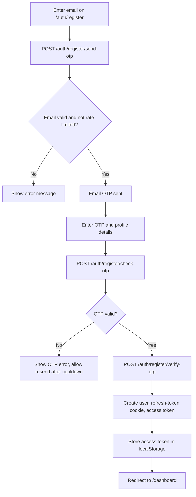
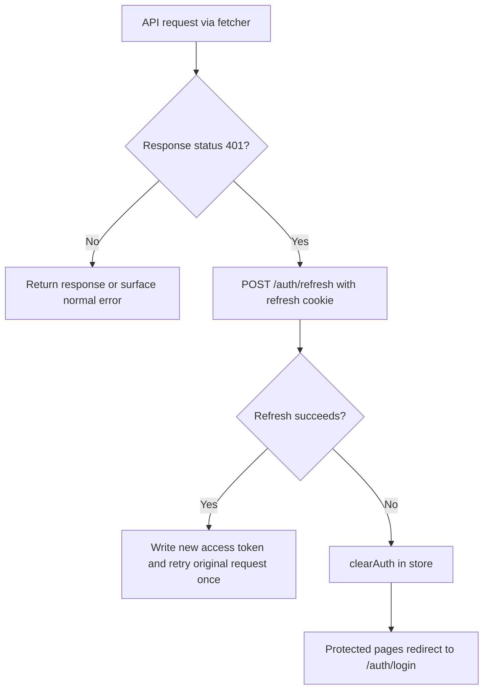
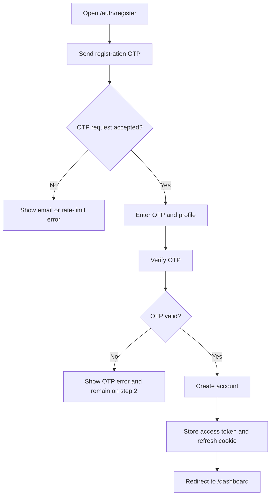
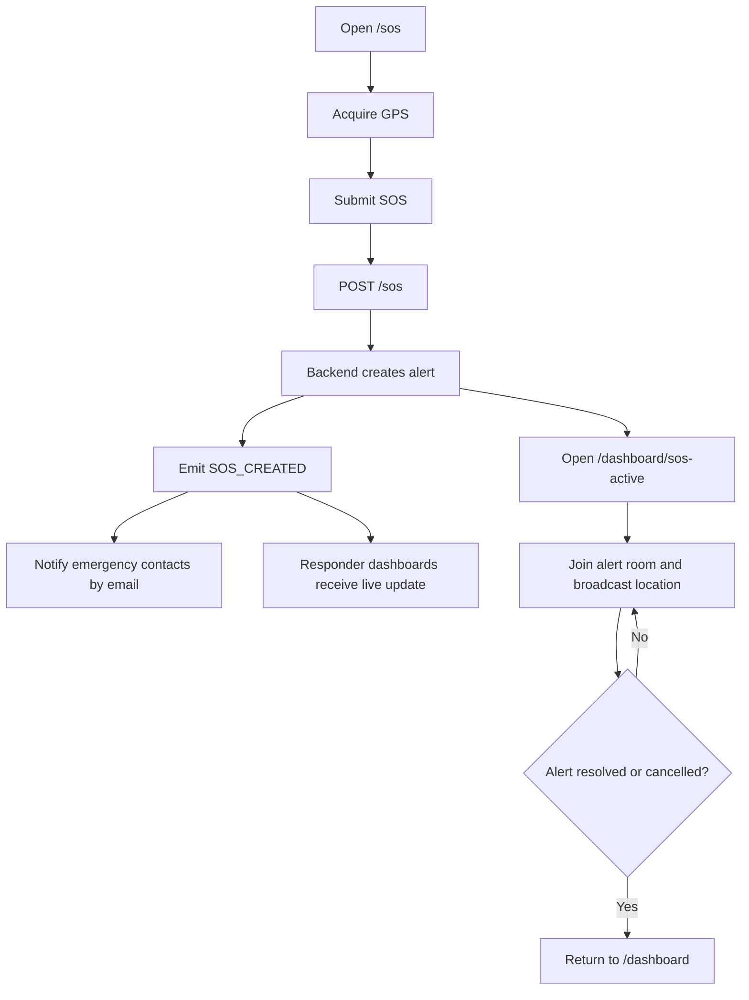
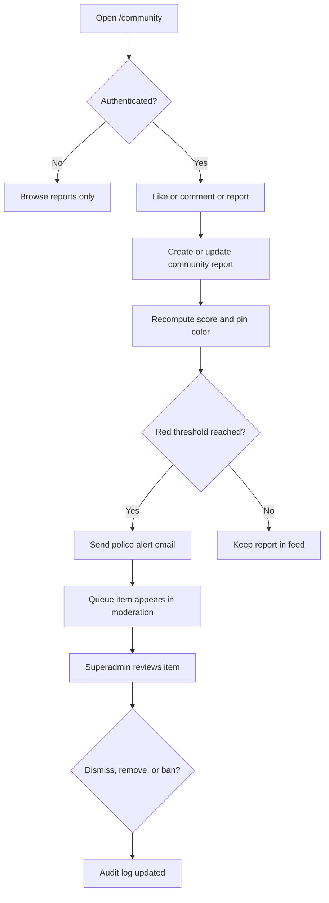
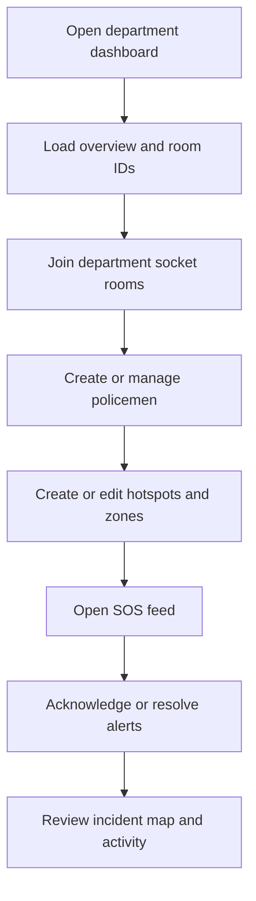

# RakshaAI Application Flow Handbook

This document reflects the current web and backend implementation in the repository.
It is intentionally scoped to the flows that actually exist today, and it avoids the older speculative flows from the previous version of this file.

Related docs:
- [`API.md`](API.md)
- [`BackendSchema.md`](BackendSchema.md)
- [`Implementation.md`](Implementation.md)
- [`UIUX.md`](UIUX.md)

## 1. System Overview

RakshaAI is a role-driven emergency response platform with four main layers:

1. Public marketing and onboarding surfaces.
2. Authenticated citizen safety tools.
3. Role-specific responder and administrator workspaces.
4. Real-time notifications, email fan-out, and audit logging.

The primary design goal is to keep urgent paths short:

- authenticate quickly
- capture the freshest location available
- notify the right people
- keep status changes visible in real time

The current implementation uses:

- JWT access tokens stored in `localStorage`
- HttpOnly refresh-token cookies
- client-side route guards for protected pages
- Socket.IO rooms for live SOS updates
- email notifications for OTP, welcome, SOS, and red-zone events

There is no SSO provider in the current codebase. The auth stack is JWT-based only.

## 2. User Role Flow Matrix

### 2.1 Role Matrix

| Role | Entry point | Accessible routes and pages | Restricted routes and why | Primary workflows | Exit points |
| --- | --- | --- | --- | --- | --- |
| `user` | Public landing page, then `/auth/register` or `/auth/login` | `/`, `/auth/login`, `/auth/register`, `/dashboard`, `/journey`, `/map`, `/community`, `/community/report`, `/ai`, `/sos`, `/dashboard/settings`, `/dashboard/emergency-contacts`, `/dashboard/sos-active` | Role dashboards under `/dashboard/superadmin`, `/dashboard/department`, `/dashboard/ngo`, `/dashboard/policeman`, `/dashboard/volunteer` are blocked by role guards | Personal safety dashboard, SOS, safety map, journey mode, community browsing, emergency contacts, AI assistant, account settings | Logout, session expiry, manual navigation away |
| `SUPERADMIN` | Seeded account or account created by a higher admin path, then `/auth/login` | `/dashboard/superadmin/*`, `/dashboard/settings`, `/dashboard`, admin alias pages | Department, NGO, officer, and volunteer workspaces are blocked because role guards redirect mismatches to login | User management, organization provisioning, hotspot oversight, moderation, audit log, platform analytics | Logout, session expiry |
| `POLICE_DEPARTMENT` | Created by superadmin workflows or seeded account, then `/auth/login` | `/dashboard/department/*`, `/dashboard/settings`, `/dashboard` | Superadmin, NGO, officer, and volunteer dashboards are blocked by `useRoleGuard('POLICE_DEPARTMENT')` | Manage policemen, hotspots, zones, SOS feed, incident map, activity report | Logout, session expiry |
| `NGO` | Created by superadmin workflows or seeded account, then `/auth/login` | `/dashboard/ngo/*`, `/dashboard/settings`, `/dashboard` | Superadmin, department, officer, and volunteer dashboards are blocked by `useRoleGuard('NGO')` | Manage volunteers, assign incidents, respond to SOS, review zones, view activity | Logout, session expiry |
| `POLICEMAN` | Created by a police department, then `/auth/login` | `/dashboard/policeman/*`, `/dashboard/settings`, `/dashboard` | Department, NGO, volunteer, and superadmin dashboards are blocked by `useRoleGuard('POLICEMAN')` | Review assigned hotspot, acknowledge and resolve SOS, view nearby incidents, file incident reports, look up stations | Logout, session expiry |
| `VOLUNTEER` | Created by an NGO, then `/auth/login` | `/dashboard/volunteer/*`, `/dashboard/settings`, `/dashboard` | Department, NGO manager, officer, and superadmin dashboards are blocked by `useRoleGuard('VOLUNTEER')` | Respond to SOS, manage assigned cases, field check-ins, zone awareness, volunteer overview | Logout, session expiry |
| Backend-only or legacy roles (`admin`, `super_admin`, `department`, `worker`, `guardian`, `police`, `volunteer`, `organization_admin`) | Not exposed as separate web dashboards in the current app | Mostly backend APIs and database records only | They are not wired to unique Next.js route trees in the current web app, or they exist as legacy aliases inside middleware and Prisma | Organization onboarding, worker records, legacy authorization checks, seeded data, audit records | N/A in the current web UI |

### 2.2 Role Narratives

- `user` is the only self-service citizen role. It can register, log in, trigger SOS, maintain emergency contacts, browse the map, and use the AI assistant.
- `SUPERADMIN` is the highest web role. It sees platform-wide metrics, can create police departments and NGOs, can manage users, and can review moderation and audit logs.
- `POLICE_DEPARTMENT` owns department-scoped responders and hotspots. It can create and manage officers, zones, hotspots, and department SOS resolution.
- `NGO` owns volunteer staffing and response dispatch. It can create volunteers, assign incidents, respond to SOS, and track activity.
- `POLICEMAN` is the field officer role. It works inside one assigned hotspot and is focused on incident triage, SOS acknowledgement, and reporting.
- `VOLUNTEER` is the NGO responder role. It works from the volunteer dashboard, handles SOS feeds, and performs check-ins and case closure.
- Legacy database roles exist because the schema still contains older naming conventions. The web app currently does not expose dedicated pages for them, so they should be treated as compatibility artifacts unless a route explicitly uses them.

## 3. Authentication and Onboarding Flow

### 3.1 What the Implementation Actually Does

- Registration is a two-stage flow: email OTP first, then profile creation.
- Login supports password login and MPIN login.
- The app stores the access token in `localStorage`.
- The server also sets a refresh-token cookie at `/api/auth`.
- The client bootstraps the session by calling `/auth/me` after hydration.
- On `401`, the fetch wrapper tries `/auth/refresh` once and retries the original request.
- If refresh fails, the client clears auth state and the user is redirected to `/auth/login`.
- First-time managed accounts are created with `mustChangePassword = true`.
- The post-login route is derived from the saved role, not from the page the user came from.
- There is no SSO provider or external identity handoff in the current implementation.

### 3.2 Authentication Flow

```mermaid
flowchart TD
  A[Open site or app] --> B{Authenticated session exists?}
  B -- No --> C[/auth/login or /auth/register/]
  B -- Yes --> D[AuthBootstrap calls GET /auth/me]
  D --> E{Session restored?}
  E -- Yes --> F[Hydrate auth store and keep access token]
  E -- No --> G[clearAuth and send user to /auth/login]
  F --> H{mustChangePassword?}
  H -- Yes --> I[/dashboard/settings/]
  H -- No --> J[getPostLoginRoute(role)]
  J --> K{Role}
  K -- SUPERADMIN --> L[/dashboard/superadmin/]
  K -- POLICE_DEPARTMENT --> M[/dashboard/department/]
  K -- NGO --> N[/dashboard/ngo/]
  K -- POLICEMAN --> O[/dashboard/policeman/]
  K -- VOLUNTEER --> P[/dashboard/volunteer/]
  K -- other or user --> Q[/dashboard/]
```

### 3.3 Registration and First Login



### 3.4 Session Refresh and Expiry



### 3.5 Error States in Auth

- Invalid password or MPIN returns `Invalid credentials.` from the backend.
- MPIN login fails with `403` when the account has no MPIN enabled.
- Expired OTP returns `OTP expired or not found. Please request a new one.`
- Too many OTP requests for the same email return `429`.
- If `/auth/me` fails during bootstrap, the client clears the saved session.
- If the refresh token is expired or revoked, the user is forced back to login.

## 4. Page-Level Flow Map

### 4.1 Public and Marketing Pages

| Route | Accessible by | Purpose | Key interactions | Navigation to and from |
| --- | --- | --- | --- | --- |
| `/` | Public | Marketing homepage and product entry point | Explore product story, create account, sign in, jump to community or map | Links to `/auth/register`, `/auth/login`, `/community`, `/map`, `/journey`, `/ai` |
| `/journey` | Public | Lightweight travel planning surface | Enter destination, set ETA, start/end journey, jump to safety map or SOS | Links to `/map` and `/sos` |
| `/community` | Public for browsing, authenticated for actions | Read community safety reports | Filter categories, like posts, comment if signed in, open report form if signed in | Links to `/community/report` |
| `/police/register` | Public | Explain that public policeman signup is disabled | Read-only info page | Routes users back to dashboard or login paths |
| `/volunteer/register` | Public | Explain that public volunteer signup is disabled | Read-only info page | Routes users back to dashboard or login paths |
| `/volunteer/dashboard` | Public redirect | Legacy alias for volunteer dashboard | Redirects immediately | Forwards to `/dashboard/volunteer` |
| `/police/dashboard` | Public redirect | Legacy alias for policeman dashboard | Redirects immediately | Forwards to `/dashboard/policeman` |

### 4.2 Auth Pages

| Route | Accessible by | Purpose | Key interactions | Navigation to and from |
| --- | --- | --- | --- | --- |
| `/auth/login` | Public | Password or MPIN sign-in | Toggle login method, submit credentials, persist identifier, route by role | Links to `/auth/register` |
| `/auth/register` | Public | Two-step self-service registration | Send OTP, verify OTP, complete profile, optionally enable MPIN | Links to `/auth/login` |
| `/auth/setup-mpin` | Authenticated only | Manual MPIN setup route | Enter and confirm MPIN through keypad UI, POST to `/auth/setup-mpin` | Returns to `/dashboard` on success; not linked by main onboarding flow |
| `/auth/change-password` | Authenticated only | Standalone password change route | Enter temporary password, set new password, submit to `/auth/change-password` | Redirects by role after success; currently not part of the default role redirect path |

### 4.3 Shared Authenticated Pages

| Route | Accessible by | Purpose | Key interactions | Navigation to and from |
| --- | --- | --- | --- | --- |
| `/dashboard` | Authenticated users | Default role-aware workspace | For `user` it shows the personal safety dashboard; for other roles it redirects to the role dashboard | Links to `/journey`, `/community`, `/map`, `/dashboard/emergency-contacts`, `/dashboard/settings`, `/sos` |
| `/dashboard/settings` | Authenticated users | Profile, password, MPIN, and logout controls | Change password, set/change/disable MPIN, log out | Back to `/dashboard`; also used as the `mustChangePassword` landing page |
| `/dashboard/emergency-contacts` | Authenticated users | Manage emergency contacts | Add, edit, delete, set primary contact | Back to `/dashboard` |
| `/dashboard/sos-active` | Authenticated users | Active SOS response screen | Read live status, cancel if safe, view live location and response timeline | Auto-returns to `/dashboard` when resolved or cancelled |
| `/ai` | Authenticated users | AI support assistant | Send chat messages, use prompt shortcuts, read assistant replies | Back to `/dashboard` |
| `/map` | Authenticated users | Nearby responders and risk map | Read layers, change layers, inspect map markers, use geolocation | Back to `/dashboard` |
| `/sos` | Authenticated users | Emergency SOS trigger screen | Pick alert type, optionally add description, send SOS, call 112 | Back to `/dashboard` |

### 4.4 Superadmin Pages

| Route | Accessible by | Purpose | Key interactions | Navigation to and from |
| --- | --- | --- | --- | --- |
| `/dashboard/superadmin` | `SUPERADMIN` only | Global platform overview | Review metrics, map, and role distribution | Links to users, create, hotspots, analytics, moderation, audit |
| `/dashboard/superadmin/users` | `SUPERADMIN` only | User administration | Search, filter, change role, suspend, delete | Back to superadmin overview |
| `/dashboard/superadmin/create` | `SUPERADMIN` only | Create department or NGO accounts | Create managed organization owners, verify email uniqueness, delete/archive organizations | Back to superadmin overview |
| `/dashboard/superadmin/hotspots` | `SUPERADMIN` only | Hotspot oversight | Review hotspot severity, status, and ownership | Back to superadmin overview |
| `/dashboard/superadmin/analytics` | `SUPERADMIN` only | SOS analytics | Read daily trend bars, regions, and map points | Back to superadmin overview |
| `/dashboard/superadmin/moderation` | `SUPERADMIN` only | Content moderation queue | Dismiss, remove, or ban authors | Back to superadmin overview |
| `/dashboard/superadmin/audit` | `SUPERADMIN` only | Audit log viewer | Filter actions and export the current page as CSV | Back to superadmin overview |
| `/dashboard/admin` | Authenticated users | Alias redirect | Immediate redirect | Forwards to `/dashboard/superadmin` |

### 4.5 Police Department Pages

| Route | Accessible by | Purpose | Key interactions | Navigation to and from |
| --- | --- | --- | --- | --- |
| `/dashboard/department` | `POLICE_DEPARTMENT` only | Department overview | Review officer count, hotspots, coverage, SOS, and activity | Links to policemen, assignments, map, SOS, zones, activity |
| `/dashboard/department/policemen` | `POLICE_DEPARTMENT` only | Manage officers | Add officer, deactivate/reactivate, inspect history | Back to department overview |
| `/dashboard/department/assignments` | `POLICE_DEPARTMENT` only | Hotspot assignment board | Create hotspot, assign officer, unassign officer | Back to department overview |
| `/dashboard/department/map` | `POLICE_DEPARTMENT` only | Department incident map | Filter incidents, resolve incidents from map | Back to department overview |
| `/dashboard/department/sos` | `POLICE_DEPARTMENT` only | SOS feed | Acknowledge with officer assignment, resolve, view map preview | Back to department overview |
| `/dashboard/department/zones` | `POLICE_DEPARTMENT` only | SafeZone and RedZone management | Create, edit, delete zones and place them on the map | Back to department overview |
| `/dashboard/department/activity` | `POLICE_DEPARTMENT` only | Activity report | Read performance metrics and charts | Back to department overview |

### 4.6 NGO Pages

| Route | Accessible by | Purpose | Key interactions | Navigation to and from |
| --- | --- | --- | --- | --- |
| `/dashboard/ngo` | `NGO` only | NGO overview | Review coverage map, volunteer presence, recent activity | Links to volunteers, response, SOS, zones, activity |
| `/dashboard/ngo/volunteers` | `NGO` only | Volunteer management | Add volunteer, deactivate/reactivate, inspect detail drawer | Back to NGO overview |
| `/dashboard/ngo/response` | `NGO` only | Incident response board | Assign volunteers to open incidents, unassign, close | Back to NGO overview |
| `/dashboard/ngo/sos` | `NGO` only | SOS feed | Dispatch volunteer, close alert, watch live arrivals | Back to NGO overview |
| `/dashboard/ngo/zones` | `NGO` only | Zone awareness | Read only safe and red zones | Back to NGO overview |
| `/dashboard/ngo/activity` | `NGO` only | Activity log | Read volunteer response charts and tables | Back to NGO overview |

### 4.7 Policeman Pages

| Route | Accessible by | Purpose | Key interactions | Navigation to and from |
| --- | --- | --- | --- | --- |
| `/dashboard/policeman` | `POLICEMAN` only | Officer overview | Review assignment state and assigned hotspot map | Links to hotspot, SOS, incidents, report, stations |
| `/dashboard/policeman/hotspot` | `POLICEMAN` only | Assigned hotspot detail | Read hotspot info, nearby incidents, assignment history | Back to officer overview |
| `/dashboard/policeman/sos` | `POLICEMAN` only | Officer SOS queue | Acknowledge and resolve, play audio cue, view map preview | Back to officer overview |
| `/dashboard/policeman/incidents` | `POLICEMAN` only | Nearby incidents | Filter by radius, severity, status, resolve open incidents | Back to officer overview |
| `/dashboard/policeman/report` | `POLICEMAN` only | Incident report form | Submit incident type, description, severity, coordinates, evidence URL | Back to officer overview |
| `/dashboard/policeman/stations` | `POLICEMAN` only | Nearby stations lookup | Resolve a nearby police-station list from OpenStreetMap | Back to officer overview |

### 4.8 Volunteer Pages

| Route | Accessible by | Purpose | Key interactions | Navigation to and from |
| --- | --- | --- | --- | --- |
| `/dashboard/volunteer` | `VOLUNTEER` only | Volunteer overview | Read NGO name, metrics, coverage map, and recent activity | Links to SOS, cases, map, check-in, zones |
| `/dashboard/volunteer/sos` | `VOLUNTEER` only | Volunteer SOS queue | Mark responding, close own response, inspect alert location | Back to volunteer overview |
| `/dashboard/volunteer/cases` | `VOLUNTEER` only | Assigned cases | Check in on a case, close a case, review history | Back to volunteer overview |
| `/dashboard/volunteer/map` | `VOLUNTEER` only | Incident awareness map | Filter incidents by severity and age | Back to volunteer overview |
| `/dashboard/volunteer/check-in` | `VOLUNTEER` only | Field check-in page | Create a standalone GPS check-in with optional note | Back to volunteer overview |
| `/dashboard/volunteer/zones` | `VOLUNTEER` only | SafeZone awareness | Read only safe and red zones | Back to volunteer overview |

## 5. Core User Journeys

### 5.1 Registration and First Login

Trigger:

- A new user opens `/auth/register`.

Steps:

1. The user submits an email address.
2. The app calls `POST /auth/register/send-otp`.
3. The user enters the OTP and profile data.
4. The app calls `POST /auth/register/check-otp` for verification.
5. The app calls `POST /auth/register/verify-otp` and receives a user plus access token.
6. The client stores the access token and refresh-cookie is set by the backend.
7. The user is redirected to `/dashboard`.

System responses:

- OTP emails are sent asynchronously.
- A registration cooldown prevents repeated OTP requests.
- The backend creates the user with role `user`.

Decision points:

- Email already registered.
- OTP invalid or expired.
- MPIN optional step enabled or skipped.

Success state:

- Authenticated session exists and the user lands on the dashboard.

Failure states:

- OTP send rate-limited.
- OTP expired or wrong.
- Validation errors for name, phone, Aadhaar, password, or MPIN.



### 5.2 Login and Role-Based Routing

Trigger:

- A returning user opens `/auth/login`.

Steps:

1. The user chooses password login or MPIN login.
2. The app submits `POST /auth/login`.
3. The backend returns user data, access token, and refresh-token cookie.
4. The client stores the session and remembers the login identifier.
5. The app calls `getPostLoginRoute(user)` and navigates to the correct workspace.

Decision points:

- If `mustChangePassword` is true, the user is routed to `/dashboard/settings`.
- Otherwise the role decides the target route.

Failure states:

- Invalid credentials.
- MPIN login used on an account without MPIN enabled.
- Server/network failure.

### 5.3 Personal Safety Workspace

Trigger:

- A user logs in or opens `/dashboard`.

Steps:

1. `AuthBootstrap` restores the session if a token exists.
2. `useProtectedRoute` forces anonymous users to `/auth/login`.
3. The dashboard shows the SOS button and links to Journey, Community, Map, Contacts, Settings, and AI.
4. The user can jump to any personal safety tool without leaving the authenticated shell.

System responses:

- The dashboard layout mounts a socket connection and personal room subscription.
- Logout clears local auth state and returns to login.

### 5.4 SOS Activation and Live Response

Trigger:

- The user opens `/sos` or presses the SOS button from the dashboard.

Steps:

1. The page tries to fetch geolocation.
2. The user selects an alert type and optionally adds a description.
3. The app calls `POST /sos`.
4. The backend creates the alert, stores the freshest available location, and emits socket events.
5. Emergency contacts receive email notifications if they have email addresses configured.
6. The UI navigates to `/dashboard/sos-active?alertId=...`.
7. The active alert screen subscribes to the alert room and broadcasts location updates every few seconds.
8. Responders can acknowledge, respond, or resolve the alert from their own dashboards.
9. If the alert is resolved or cancelled, the active screen returns the user to `/dashboard`.

System responses:

- `SOS_CREATED` is broadcast over Socket.IO.
- Department, NGO, and officer-specific rooms receive scoped alert events.
- `LOCATION_UPDATE`, `VOLUNTEER_ACCEPTED`, `POLICE_ACCEPTED`, `ALERT_STATUS_CHANGED`, and `ALERT_RESOLVED` update the active screen.

Decision points:

- Geolocation available or denied.
- Alert cancelled by the user if they are safe.
- Responder accepts or resolves first.

Success state:

- The alert is tracked live until it is resolved or cancelled.

Failure states:

- SOS create request fails.
- Location permission denied.
- Socket connection fails or reconnects later.



### 5.5 Community Reporting and Moderation

Trigger:

- A visitor opens `/community`, then an authenticated user submits `/community/report`.

Steps:

1. Public users can browse reports and heatmap summaries.
2. Authenticated users can upvote and comment on reports.
3. Authenticated users can submit a new report with coordinates and description.
4. The backend scores the report based on upvotes and comments.
5. If the score crosses the red threshold, the report can trigger a police alert email.
6. Superadmin moderation staff review flagged incidents and comments in `/dashboard/superadmin/moderation`.
7. Moderators can dismiss the item, remove the content, or ban the author.

System responses:

- Report lists refresh every 30 seconds on the public page.
- Report scoring can change pin color in real time after votes or comments.
- Moderation actions are audit logged.

Failure states:

- Anonymous users can browse but cannot like, comment, or create reports.
- A report submission fails if the map pin was not chosen.
- Upvotes and comments fail when the backend returns a validation or auth error.



### 5.6 Department Operations

Trigger:

- A `POLICE_DEPARTMENT` user opens `/dashboard/department`.

Steps:

1. The overview loads live counts, hotspots, SOS volume, and activity.
2. The department can create policemen and view officer detail.
3. The department can create hotspots and assign a policeman to one hotspot at a time.
4. The department can manage SafeZone and RedZone circles on a map.
5. The department can view SOS alerts, acknowledge them, and resolve them.
6. The incident map and activity report provide operational context.

System responses:

- The department dashboard joins department room IDs over Socket.IO.
- `SOS_CREATED` increments live SOS counters.
- Department feeds can show browser notifications when supported.

Failure states:

- No hotspot configured yet falls back to a generic area.
- No officer assigned to a hotspot or SOS alert leaves the item in an unassigned state.
- Map and lookup services can fail independently without breaking the rest of the dashboard.



### 5.7 NGO and Volunteer Operations

Trigger:

- A `NGO` or `VOLUNTEER` user opens their dashboard.

NGO steps:

1. Load coverage, volunteers, response demand, SOS feed, and activity.
2. Create and deactivate volunteers.
3. Assign incidents to volunteers or close them.
4. Dispatch volunteers to SOS alerts and close the alert after response.
5. Review zone awareness and activity trends.

Volunteer steps:

1. Load volunteer-specific overview and assigned case history.
2. Join NGO socket rooms and listen for live SOS alerts.
3. Mark an alert as responding or close the response.
4. Check into an assigned case or create a standalone field check-in.
5. Review open incidents and zone awareness maps.

System responses:

- NGO and volunteer dashboards both listen for `SOS_CREATED`.
- The volunteer check-in and case flows write location data through the backend.
- Active cases and alerts move into history once closed.

Failure states:

- Missing volunteer assignment prevents response actions from being meaningful.
- Geolocation denial blocks check-in until the browser can provide a location.

### 5.8 Settings, MPIN, and Emergency Contacts

Trigger:

- The user opens `/dashboard/settings` or `/dashboard/emergency-contacts`.

Steps:

1. Settings loads the current account via `/auth/me`.
2. The user can change the password.
3. The user can set, change, or disable MPIN.
4. The user can log out from settings or the dashboard shell.
5. Emergency contacts can be added, edited, deleted, or promoted to primary.

System responses:

- Success messages are shown inline.
- MPIN fields enforce 6 digits and block weak values.
- Settings updates mutate the auth store when the password change succeeds and `mustChangePassword` is cleared.

Failure states:

- Settings profile fetch fails.
- Password mismatch or wrong current password.
- MPIN mismatch, invalid digits, or weak MPIN.
- Emergency contact validation errors for phone or email.

### 5.9 Safety Map, Journey Mode, and AI Assistant

Trigger:

- A user opens `/journey`, `/map`, or `/ai`.

Steps:

1. Journey mode lets the user define a destination and expected arrival time.
2. The user can end the journey or jump to the safety map and SOS at any time.
3. The safety map fetches nearby volunteers, police, safe zones, risk, and incidents after geolocation is available.
4. The AI assistant accepts messages and returns guidance from the backend chat endpoint.

System responses:

- Journey mode is stateful only in memory for the current session.
- Safety map data refreshes periodically where configured.
- AI errors surface as human-readable assistant messages.

## 6. Form Submission Flows

| Form | Page | Fields and validation | Submission target | Success behavior | Error behavior and async effects |
| --- | --- | --- | --- | --- | --- |
| Registration OTP request | `/auth/register` | Email required, valid email format | `POST /auth/register/send-otp` | OTP email sent, move to step 2 | 409 if email already exists, 429 if too many requests |
| Registration OTP check | `/auth/register` | Email + 6-digit OTP | `POST /auth/register/check-otp` | Marks step as verified and unlocks profile submission | Expired or invalid OTP shows inline error |
| Final registration submit | `/auth/register` | Full name, phone, Aadhaar, password, optional MPIN | `POST /auth/register/verify-otp` | Creates user, sets refresh cookie, stores access token, redirects to dashboard | Validation errors, backend errors, or network failures |
| Password login | `/auth/login` | Identifier + password | `POST /auth/login` | Stores session and routes by role | Invalid credentials or server/network failure |
| MPIN login | `/auth/login` | Identifier + 6-digit MPIN | `POST /auth/login` | Stores session and routes by role | `403` if MPIN is disabled, invalid credentials otherwise |
| Manual MPIN setup | `/auth/setup-mpin` | Two-step 6-digit MPIN entry | `POST /auth/setup-mpin` | Returns to dashboard | Token errors, validation errors, or network failure |
| Password change | `/auth/change-password` and `/dashboard/settings` | Current password, new password, confirmation | `POST /auth/change-password` | Clears `mustChangePassword`, updates session state | Wrong current password, mismatch, or auth failure |
| Emergency contacts add/edit | `/dashboard/emergency-contacts` | Name, relationship, phone, optional email, primary toggle | `POST /emergency-contacts` or `PUT /emergency-contacts/:id` | Reloads list and shows toast | Validation errors, save failure |
| Emergency contacts delete / primary | `/dashboard/emergency-contacts` | Contact id | `DELETE /emergency-contacts/:id` or `PATCH /emergency-contacts/:id/primary` | Reloads list and updates primary order | Delete/update failure or constraint issue |
| SOS creation | `/sos` | Alert type, optional description, live geolocation | `POST /sos` | Redirects to `/dashboard/sos-active?alertId=...` | Location denial is tolerated; create failure shows emergency retry message |
| Community report submit | `/community/report` | Category, description, latitude, longitude, optional title, address, city | `POST /community` | Returns to `/community` | Pin not selected, validation errors, or network failure |
| Community like | `/community` | Report id | `POST /community/upvote` | Refreshes the feed and score | Auth or backend errors |
| Community comment | `/community` | Report id + comment content | `POST /community/comments` | Clears draft and refreshes the feed | Empty comment, auth, or backend error |
| Superadmin create department | `/dashboard/superadmin/create` | Name, email, temporary password | `POST /admin/departments` | Reloads managed organizations | Email conflict, validation error |
| Superadmin create NGO | `/dashboard/superadmin/create` | Name, email, temporary password | `POST /admin/ngos` | Reloads managed organizations | Email conflict, validation error |
| Superadmin user role change | `/dashboard/superadmin/users` | User id + target role | `PATCH /admin/users/:id/role` | Table refreshes | Role validation or permission failure |
| Superadmin suspend / delete user | `/dashboard/superadmin/users` | User id, suspend state | `PATCH /admin/users/:id/suspend` or `DELETE /admin/users/:id` | Table refreshes | Seed-user protection or relationship constraints |
| Department create policeman | `/dashboard/department/policemen` | Name, email, badge number, temporary password | `POST /department/policemen` | Officer row appears after reload | Duplicate email or validation failure |
| Department hotspot create / assign | `/dashboard/department/assignments` | Hotspot name, coordinates, radius, severity, officer id | `POST /department/hotspots`, `POST /department/hotspots/:id/assign` | Hotspot appears and officer assignment updates | Missing selection or backend validation |
| Department zone create / edit | `/dashboard/department/zones` | Zone name, type, radius, coordinates, description | `POST /department/zones`, `PATCH /department/zones/:id` | Map and list refresh | Input errors, permission errors |
| Department SOS acknowledge / resolve | `/dashboard/department/sos` | Alert id + officer id for acknowledge | `PATCH /department/sos/:id/acknowledge`, `PATCH /department/sos/:id/resolve` | Alert moves out of active list | No officer selected or status conflict |
| NGO create volunteer | `/dashboard/ngo/volunteers` | Name, email, temporary password | `POST /ngo/volunteers` | Volunteer list refreshes | Duplicate email or validation failure |
| NGO incident assign / close | `/dashboard/ngo/response` | Incident id + volunteer id for assign | `POST /ngo/incidents/:id/assign`, `DELETE /ngo/incidents/:id/assign`, `PATCH /ngo/incidents/:id/close` | Table refreshes | No volunteer selected or backend validation failure |
| NGO SOS respond / close | `/dashboard/ngo/sos` | Alert id + volunteer id for respond | `PATCH /ngo/sos/:id/respond`, `PATCH /ngo/sos/:id/close` | SOS feed refreshes | No volunteer selected or state conflict |
| Policeman incident report | `/dashboard/policeman/report` | Type, description, severity, lat, lng, optional evidence URL | `POST /officer/incidents` | Success message and cleared form | Location missing, validation error, or backend failure |
| Volunteer case check-in | `/dashboard/volunteer/cases` | Case id + browser geolocation | `PATCH /volunteer/cases/:id/checkin` | Case history refreshes | Geolocation unavailable or failed |
| Volunteer standalone check-in | `/dashboard/volunteer/check-in` | Browser geolocation + optional note | `POST /volunteer/checkin` | Success message and history refresh | Geolocation failure or validation error |

## 7. Background and Async Flow Triggers

- Session restoration starts in `AuthBootstrap` after client hydration and calls `/auth/me`.
- `fetcher` automatically retries once after a `401` by calling `/auth/refresh` and reusing the returned access token.
- `useSocket` opens a single Socket.IO connection after auth is ready and joins the personal user room.
- The dashboard shell subscribes to role-specific socket rooms and keeps live SOS counters updated.
- `/sos` triggers `SOS_CREATED` broadcasts, location persistence, and emergency-contact emails.
- Community reports can trigger police alert emails when a report crosses the red threshold.
- Red-zone triggers send department emails asynchronously.
- Managed account creation sends welcome emails after the database transaction finishes.
- OTP registration sends an email and enforces rate limits and expiry windows.
- Department SOS screens can request browser notifications when the browser allows them.
- `/dashboard/sos-active` broadcasts GPS location every 5 seconds while the alert remains active.
- The mobile app download button calls `/api/app/download` and uses the returned presigned URL to fetch the APK.

### 7.1 Notification and Socket Model

- `SOS_CREATED` is the primary fan-out event.
- `LOCATION_UPDATE` keeps active SOS screens synced.
- `VOLUNTEER_ACCEPTED`, `POLICE_ACCEPTED`, `ALERT_STATUS_CHANGED`, and `ALERT_RESOLVED` drive the alert timeline.
- Department, NGO, and officer dashboards join separate room prefixes returned by their `navigation-meta` API calls.

### 7.2 Email Flows

- Registration OTP emails are sent from the auth service.
- Welcome emails are sent when superadmin or organization workflows create managed accounts.
- SOS emails go to emergency contacts that have email addresses.
- Police alert emails are generated when community reports become high-risk.
- Red-zone emails go to nearby departments.

## 8. Error and Edge Case Flows

### 8.1 Unauthorized Access

- Protected pages call `useProtectedRoute` or `useRoleGuard`.
- Anonymous users are redirected to `/auth/login`.
- Wrong-role users are also redirected to `/auth/login`.
- Backend APIs return `401` for invalid or expired access tokens and `403` for forbidden roles.

### 8.2 Not Found Handling

- Backend API routes that do not match return a JSON 404 from the Express `notFoundHandler`.
- The web app does not currently define a custom `app/not-found.tsx`, so route-miss handling falls back to the framework default.

### 8.3 Session Expiry Mid-Workflow

- If a request returns `401`, the fetch layer attempts refresh once.
- If refresh works, the request is retried transparently.
- If refresh fails, the auth store is cleared and protected pages redirect to login.

### 8.4 Geolocation and Map Failure

- `SOS` can still be sent if geolocation fails or is denied.
- Community report submission cannot complete until the map pin is selected.
- Journey mode does not persist geolocation; it only uses browser state for the current session.
- Police-station lookup and map layers can fail independently without breaking the rest of the page.

### 8.5 Invalid Input and Validation Failures

- OTP and MPIN inputs enforce 6 digits.
- Passwords enforce length and complexity requirements.
- Aadhaar numbers must be 12 digits.
- Phone numbers are validated as Indian numbers in registration.
- Community report forms require a category and coordinates.
- Emergency contacts require a valid phone number, and email is optional but validated when present.

### 8.6 Empty States

- Community feed shows an empty state when no reports exist for the selected filter.
- Emergency contacts shows an empty state when the user has not added contacts.
- Volunteer and department resolved queues collapse into history sections instead of disappearing abruptly.
- The policeman hotspot page has an explicit "no assignment" state.
- The dashboard and role pages show loading placeholders while auth bootstraps.

### 8.7 Duplicate or Legacy Routes

- `/dashboard/admin` is a redirect alias, not a separate workspace.
- `/volunteer/dashboard` and `/police/dashboard` are legacy aliases.
- `/auth/change-password` and `/auth/setup-mpin` are valid routes, but the main onboarding flow now favors the dashboard settings screen and inline MPIN setup.

## 9. Implementation Notes for Engineers and QA

- The source of truth for role routing is `getPostLoginRoute(user)`.
- The source of truth for protected-page access is `useProtectedRoute` and `useRoleGuard`.
- The source of truth for the navigation menu is `getDashboardNavigation(role)`.
- The source of truth for API retry behavior is the web fetch wrapper, not each page component.
- The source of truth for socket events is the backend Socket.IO server and the typed client in `apps/web/src/lib/socket.ts`.
- There is no current file-upload UI in the web app. The only evidence-like field in the current frontend is the officer incident report's `evidenceUrl`, which is text-only.

## 10. What Changed From the Older Flow Doc

- Removed unsupported "offline SMS escalation" and similar speculative paths.
- Removed Flutter/mobile-first assumptions from the primary flow description.
- Replaced generic AI and map narratives with actual route and API behavior.
- Added the real session refresh behavior, refresh-cookie handling, and automatic retry logic.
- Added the actual role-specific route tree and alias redirects.
- Added the new settings, emergency contacts, and legacy/manual auth routes.
- Clarified that file upload is not currently exposed in the web UI.
