# Backend Schema Reference

RakshaAI backend schema handbook for the current codebase state.

Source of truth:
- [`prisma/schema.prisma`](../prisma/schema.prisma)
- [`prisma/migrations/`](../prisma/migrations)
- [`prisma/seed.ts`](../prisma/seed.ts)
- Backend services and middleware under [`apps/backend/src/`](../apps/backend/src)

Related application flow reference:
- [`AppFlow.md`](AppFlow.md)
Related implementation and ops docs:
- [`Implementation.md`](Implementation.md)
- [`API.md`](API.md)
- [`ARCHITECTURE.md`](ARCHITECTURE.md)
- [`DEPLOYMENT.md`](DEPLOYMENT.md)
- [`ENVIRONMENT.md`](ENVIRONMENT.md)
- [`RUNBOOK.md`](RUNBOOK.md)

## 1. Schema Overview

- Database engine: PostgreSQL 15+ with PostGIS, pg_trgm, and uuid-ossp extensions.
- ORM: Prisma Client 5.12.x / Prisma CLI 5.12.x.
- Models: 35.
- Enums: 20.
- Relation fields: 75.
- Explicit indexes: 42.
- Field-level unique constraints: 13.
- Composite unique constraints: 2.

Notable design patterns:
- Auth is session based with refresh-token rotation. Session state is persisted in `UserSession`.
- Role hierarchy is modeled directly in `User.role`, with legacy and canonical enum values coexisting.
- Soft lifecycle flags are used instead of hard deletes in many places: `isActive`, `deletedAt`, `status`, `isVerified`, `mustChangePassword`, `isSeed`.
- Geospatial data is stored as floats in Prisma and supplemented by raw PostGIS queries in backend services.
- Auditability is first-class through `AuditLog`, `AlertStatusHistory`, `NotificationLog`, and several event tables.
- Notifications and alerts are fan-out heavy, with email, socket, and persisted notification records.

## 2. Complete ER Diagram

This diagram shows the primary entities and their key links. The detailed field inventory lives in the model reference below.

```mermaid
erDiagram
  User ||--o| UserSafetyProfile : has
  User ||--o{ EmergencyContact : owns
  User ||--o{ UserSession : opens
  User ||--o{ OtpVerification : verifies
  User ||--o| Volunteer : profiles
  User ||--o| PoliceAccount : profiles
  User ||--o{ SosAlert : triggers
  User ||--o{ UserLocation : records
  User ||--o{ Journey : plans
  User ||--o{ Geofence : creates
  User ||--o{ CommunityReport : reports
  User ||--o{ ReportUpvote : votes
  User ||--o{ ReportComment : comments
  User ||--o{ AiRiskAnalysis : receives
  User ||--o{ AiRouteRecommendation : receives
  User ||--o{ EmergencyEvidence : uploads
  User ||--o{ GpsEvidenceLog : logs
  User ||--o{ TransportTrip : tracks
  User ||--o{ FakeCall : schedules
  User ||--o{ CyberReport : files
  User ||--o{ PushToken : registers
  User ||--o{ NotificationLog : receives
  User ||--o{ GuardianTrackingSession : guards
  User ||--o{ AlertStatusHistory : changes
  User ||--o{ SafeZone : adds
  User ||--o{ RedZone : triggers
  User ||--o{ AuditLog : acts
  User ||--o{ Organization : creates
  User ||--o{ User : creates_child_users
  User ||--o{ User : belongs_to_department
  User ||--o{ User : belongs_to_ngo

  Volunteer ||--o{ VolunteerAvailability : has
  Volunteer ||--o{ SosAlert : is_assigned
  PoliceStation ||--o{ PoliceAccount : has
  PoliceStation ||--o{ SosAlert : is_assigned
  PoliceAccount ||--o{ SosAlert : is_assigned
  SosAlert ||--o{ AlertStatusHistory : history
  SosAlert ||--o{ AlertNotification : notifications
  SosAlert ||--o{ EmergencyEvidence : evidence
  SosAlert ||--o{ GpsEvidenceLog : gps_logs
  SosAlert ||--o{ AiEmergencyClassification : classifications
  SosAlert ||--o{ TransportTrip : linked_trip

  Journey ||--o{ Geofence : protects
  Journey ||--o{ UserLocation : location_stream
  Journey ||--o| AiRouteRecommendation : recommended_route
  Journey ||--o{ TransportTrip : related_trip

  SafetyHotspot ||--o{ CommunityReport : clusters
  SafetyHotspot }o--|| Worker : assigned_to

  CommunityReport ||--o{ ReportUpvote : votes
  CommunityReport ||--o{ ReportComment : comments
  CommunityReport }o--|| SafetyHotspot : may_map_to

  SafeZone }o--|| Organization : owned_by_department
  SafeZone }o--|| User : added_by

  RedZone }o--|| User : triggered_by
  RedZone }o--o{ Organization : notified_departments

  AiRiskAnalysis }o--|| User : for_user
  AiRouteRecommendation }o--|| User : for_user
  AiRouteRecommendation }o--|| Journey : for_journey
  EmergencyEvidence }o--|| User : uploaded_by
  EmergencyEvidence }o--|| SosAlert : for_alert
  GpsEvidenceLog }o--|| User : captured_by
  GpsEvidenceLog }o--|| SosAlert : for_alert

  TransportTrip }o--|| User : by_user
  TransportTrip }o--|| Journey : optional_journey
  TransportTrip }o--|| SosAlert : optional_alert

  CyberReport }o--|| User : reported_by
  CyberReport }o--|| User : assigned_admin

  PushToken }o--|| User : owned_by
  NotificationLog }o--|| User : for_user
  GuardianTrackingSession }o--|| User : guardian
  GuardianTrackingSession }o--|| User : tracked_user
  Organization }o--|| User : created_by
  Organization ||--o{ Worker : employs
  Organization ||--o{ SafeZone : owns_safe_zones
  Organization ||--o{ RedZone : notified
  Worker }o--|| User : optional_user_link
  Worker }o--|| Organization : belongs_to
  AuditLog }o--|| User : actor
```

## 3. Model-by-Model Reference

### User

Purpose:
- Core identity record for citizens, volunteers, police officers, department accounts, NGO accounts, superadmins, and related helper roles.
- It is the main pivot table for almost every other entity.

Fields:

| Field | Type | Constraints / Notes |
|---|---|---|
| id | String | PK, UUID default `uuid_generate_v4()` |
| fullName | String | required, mapped to `full_name` |
| email | String | required, unique |
| phone | String? | optional, unique |
| aadhaarNumber | String? | optional, unique, mapped to `aadhaar_number` |
| passwordHash | String | required, mapped to `password_hash` |
| mpinHash | String? | optional, mapped to `mpin_hash` |
| mpinEnabled | Boolean | default `false` |
| role | UserRole | default `user` |
| departmentId | String? | optional FK to `User.id`, mapped to `department_id` |
| ngoId | String? | optional FK to `User.id`, mapped to `ngo_id` |
| createdById | String? | optional FK to `User.id`, mapped to `created_by_id` |
| gender | Gender? | optional |
| dateOfBirth | DateTime? | optional, date only |
| profileImageUrl | String? | optional |
| isActive | Boolean | default `true` |
| isVerified | Boolean | default `false` |
| isPhoneVerified | Boolean | default `false` |
| isEmailVerified | Boolean | default `false` |
| isSeed | Boolean | default `false` |
| mustChangePassword | Boolean | default `false` |
| lastLoginAt | DateTime? | optional |
| createdAt | DateTime | default `now()` |
| updatedAt | DateTime | auto-updated |
| deletedAt | DateTime? | optional soft delete marker |

Relations:
- Owns safety profile, contacts, sessions, OTP verifications, locations, journeys, geofences, reports, alerts, evidence, notifications, push tokens, audit logs, and hierarchy children.
- Optional self-relations:
  - `departmentId` -> department user.
  - `ngoId` -> NGO user.
  - `createdById` -> creator user.

Indexes and constraints:
- `@unique`: email, phone, aadhaarNumber.
- Indexes: `idx_users_email`, `idx_users_phone`, `idx_users_role`, `idx_users_department_id`, `idx_users_ngo_id`, `idx_users_created_by_id`.

Runtime use:
- Auth and refresh token lookup: `apps/backend/src/services/auth.service.ts`.
- Role-gated dashboards and onboarding: `apps/web/src/app/**`.
- Hierarchy creation and managed accounts: `apps/backend/src/services/hierarchy.service.ts`, `apps/backend/src/services/admin.service.ts`.

### UserSafetyProfile

Purpose:
- Extended safety preferences and personal medical context for the user.

Fields:

| Field | Type | Constraints / Notes |
|---|---|---|
| id | String | PK, UUID |
| userId | String | required, unique FK to `User.id`, cascade delete |
| bloodGroup | String? | optional |
| medicalConditions | String[] | array |
| allergies | String[] | array |
| disabilityNotes | String? | optional |
| medications | String? | optional |
| emergencyNotes | String? | optional |
| homeAddress | String? | optional |
| workAddress | String? | optional |
| voiceSosKeyword | String | default `help me` |
| shakeSensitivity | String | default `medium` |
| silentSosEnabled | Boolean | default `false` |
| autoEvidence | Boolean | default `true` |
| createdAt | DateTime | default `now()` |
| updatedAt | DateTime | auto-updated |

Relations:
- Belongs to one `User`.

Runtime use:
- Safety preferences and emergency personalization in alert flows.

### EmergencyContact

Purpose:
- Emergency contacts for calls, SMS, alert escalation, and live tracking permissions.

Fields:

| Field | Type | Constraints / Notes |
|---|---|---|
| id | String | PK, UUID |
| userId | String | required FK to `User.id`, cascade delete |
| name | String | required |
| phone | String | required |
| email | String? | optional |
| relationship | String | required |
| isPrimary | Boolean | default `false` |
| priorityOrder | Int | default `1` |
| notifyOnSos | Boolean | default `true` |
| notifyOnJourney | Boolean | default `true` |
| canTrackLive | Boolean | default `true` |
| isAppUser | Boolean | default `false` |
| linkedUserId | String? | optional app-user linkage |
| createdAt | DateTime | default `now()` |
| updatedAt | DateTime | auto-updated |

Indexes:
- `idx_emergency_contacts_user`.

Runtime use:
- SOS email/call notification fan-out in `apps/backend/src/services/sos.service.ts`.

### UserSession

Purpose:
- Persisted refresh/session store for login sessions.

Fields:

| Field | Type | Constraints / Notes |
|---|---|---|
| id | String | PK, UUID |
| userId | String | required FK to `User.id`, cascade delete |
| tokenHash | String | required, indexed |
| deviceType | String? | optional |
| deviceId | String? | optional |
| ipAddress | String? | optional |
| userAgent | String? | optional |
| isActive | Boolean | default `true` |
| expiresAt | DateTime | required |
| createdAt | DateTime | default `now()` |

Indexes:
- `idx_sessions_user_id`
- `idx_sessions_token`

Runtime use:
- Refresh token rotation and session invalidation in `apps/backend/src/services/auth.service.ts`.

### OtpVerification

Purpose:
- OTP tracking for registration and verification steps.

Fields:

| Field | Type | Constraints / Notes |
|---|---|---|
| id | String | PK, UUID |
| userId | String? | optional FK to `User.id`, cascade delete |
| email | String | required, indexed |
| identifier | String | required |
| otpHash | String | required |
| purpose | String | required |
| attempts | Int | default `0` |
| maxAttempts | Int | default `3` |
| isUsed | Boolean | default `false` |
| verified | Boolean | default `false` |
| expiresAt | DateTime | required |
| createdAt | DateTime | default `now()` |

Runtime use:
- Registration OTP send/validate/complete in auth service.

### Volunteer

Purpose:
- Worker-style volunteer profile linked one-to-one with `User`.

Fields:

| Field | Type | Constraints / Notes |
|---|---|---|
| id | String | PK, UUID |
| userId | String | required, unique FK to `User.id`, cascade delete |
| status | VolunteerStatus | default `offline` |
| verificationStatus | VerificationStatus | default `pending` |
| aadhaarNumber | String? | optional |
| aadhaarVerified | Boolean | default `false` |
| govtIdUrl | String? | optional |
| selfieUrl | String? | optional |
| ngoAffiliation | String? | optional |
| skills | String[] | array |
| languagesSpoken | String[] | array |
| serviceRadiusKm | Int | default `5` |
| totalResponses | Int | default `0` |
| successfulResponses | Int | default `0` |
| rating | Decimal | default `0.00` |
| ratingCount | Int | default `0` |
| lastActiveAt | DateTime? | optional |
| createdAt | DateTime | default `now()` |
| updatedAt | DateTime | auto-updated |

Relations:
- Belongs to `User`.
- Has many `VolunteerAvailability`.
- Can be assigned to `SosAlert`.

Runtime use:
- Volunteer matching and availability gating in `apps/backend/src/services/volunteer-dashboard.service.ts`, `sos.service.ts`.

### VolunteerAvailability

Purpose:
- Availability windows for volunteer duty scheduling.

Fields:

| Field | Type | Constraints / Notes |
|---|---|---|
| id | String | PK, UUID |
| volunteerId | String | required FK to `Volunteer.id`, cascade delete |
| dayOfWeek | Int | required |
| startTime | DateTime | `@db.Time` |
| endTime | DateTime | `@db.Time` |
| isActive | Boolean | default `true` |
| createdAt | DateTime | default `now()` |

### PoliceStation

Purpose:
- Physical police station registry for dispatch and assignment.

Fields:

| Field | Type | Constraints / Notes |
|---|---|---|
| id | String | PK, UUID |
| name | String | required |
| stationCode | String? | optional, unique |
| address | String | required |
| city | String | required |
| state | String | required |
| pincode | String? | optional |
| phonePrimary | String? | optional |
| phoneSecondary | String? | optional |
| email | String? | optional |
| erssLinked | Boolean | default `false` |
| isActive | Boolean | default `true` |
| latitude | Float? | optional |
| longitude | Float? | optional |
| createdAt | DateTime | default `now()` |

Relations:
- Owns many `PoliceAccount`.
- Can be linked to `SosAlert` as assignment target.

Runtime use:
- Dispatch routing and station assignment in SOS escalations.

### PoliceAccount

Purpose:
- Officer-specific profile for a user, including station and badge identity.

Fields:

| Field | Type | Constraints / Notes |
|---|---|---|
| id | String | PK, UUID |
| userId | String | required, unique FK to `User.id`, cascade delete |
| badgeNumber | String | required, unique |
| rank | String? | optional |
| stationId | String | required FK to `PoliceStation.id` |
| isOnDuty | Boolean | default `false` |
| verificationStatus | VerificationStatus | default `pending` |
| govtIdUrl | String? | optional |
| createdAt | DateTime | default `now()` |
| updatedAt | DateTime | auto-updated |

Relations:
- Belongs to `User` and `PoliceStation`.
- Can be assigned `SosAlert`.

Runtime use:
- Officer assignment, duty status, and dispatch in `sos.service.ts`, `officer.service.ts`.

### SosAlert

Purpose:
- Central emergency alert record used for SOS, escalation, and resolution workflows.

Fields:

| Field | Type | Constraints / Notes |
|---|---|---|
| id | String | PK, UUID |
| alertCode | String | required, unique |
| userId | String | required FK to `User.id` |
| triggerMethod | SosTriggerMethod | required |
| alertType | AlertType | default `general_danger` |
| status | AlertStatus | default `pending` |
| severity | IncidentSeverity | default `high` |
| description | String? | optional |
| triggerLatitude | Float? | optional |
| triggerLongitude | Float? | optional |
| triggerAddress | String? | optional |
| currentLatitude | Float? | optional |
| currentLongitude | Float? | optional |
| assignedVolunteerId | String? | optional FK to `Volunteer.id` |
| assignedPoliceId | String? | optional FK to `PoliceAccount.id` |
| assignedStationId | String? | optional FK to `PoliceStation.id` |
| aiClassification | AlertType? | optional AI result |
| aiConfidenceScore | Decimal? | optional |
| aiRiskScore | Decimal? | optional |
| escalatedAt | DateTime? | optional |
| escalationReason | String? | optional |
| resolvedAt | DateTime? | optional |
| resolutionNotes | String? | optional |
| volunteerEtaSeconds | Int? | optional |
| policeEtaSeconds | Int? | optional |
| isTestAlert | Boolean | default `false` |
| createdAt | DateTime | default `now()` |
| updatedAt | DateTime | auto-updated |

Relations:
- Belongs to one `User`.
- Optional assignment to one `Volunteer`, one `PoliceAccount`, and one `PoliceStation`.
- Owns `AlertStatusHistory`, `AlertNotification`, `EmergencyEvidence`, `GpsEvidenceLog`, `AiEmergencyClassification`, and `TransportTrip`.

Indexes:
- `idx_sos_alerts_user_id`
- `idx_sos_alerts_status`
- `idx_sos_alerts_created_at`

Runtime use:
- Core emergency response workflow in `apps/backend/src/services/sos.service.ts`.

### AlertStatusHistory

Purpose:
- Immutable-ish status timeline for each alert.

Fields:

| Field | Type | Constraints / Notes |
|---|---|---|
| id | String | PK, UUID |
| alertId | String | required FK to `SosAlert.id`, cascade delete |
| changedById | String? | optional FK to `User.id` |
| changedByRole | UserRole? | optional |
| oldStatus | AlertStatus? | optional |
| newStatus | AlertStatus | required |
| notes | String? | optional |
| createdAt | DateTime | default `now()` |

Runtime use:
- Written whenever alert status changes in SOS workflow.

### AlertNotification

Purpose:
- Per-recipient notification dispatch log for alert fan-out.

Fields:

| Field | Type | Constraints / Notes |
|---|---|---|
| id | String | PK, UUID |
| alertId | String | required FK to `SosAlert.id`, cascade delete |
| recipientId | String? | optional FK-like reference |
| recipientPhone | String? | optional |
| recipientEmail | String? | optional |
| notificationType | NotificationType | required |
| channel | String | required |
| message | String? | optional |
| isDelivered | Boolean | default `false` |
| deliveredAt | DateTime? | optional |
| failureReason | String? | optional |
| retryCount | Int | default `0` |
| createdAt | DateTime | default `now()` |

Index:
- `idx_alert_notifications_alert`

### UserLocation

Purpose:
- Time-series location feed for live tracking, journey monitoring, and SOS context.

Fields:

| Field | Type | Constraints / Notes |
|---|---|---|
| id | String | PK, UUID |
| userId | String | required FK to `User.id`, cascade delete |
| latitude | Float | required |
| longitude | Float | required |
| accuracyMeters | Decimal? | optional |
| altitudeMeters | Decimal? | optional |
| speedMps | Decimal? | optional |
| bearingDegrees | Decimal? | optional |
| batteryLevel | Int? | optional |
| isSharing | Boolean | default `true` |
| alertId | String? | optional alert linkage |
| journeyId | String? | optional FK to `Journey.id` |
| recordedAt | DateTime | default `now()` |

Indexes:
- `idx_user_locations_user_id`
- `idx_user_locations_recorded`

Runtime use:
- Live map and tracking streams in `maps.service.ts`, `sos.service.ts`, `journey` flows.

### Journey

Purpose:
- Planned trip record with risk scoring and deviation detection.

Fields:

| Field | Type | Constraints / Notes |
|---|---|---|
| id | String | PK, UUID |
| userId | String | required FK to `User.id`, cascade delete |
| originLatitude | Float | required |
| originLongitude | Float | required |
| originAddress | String? | optional |
| destinationLatitude | Float | required |
| destinationLongitude | Float | required |
| destinationAddress | String? | optional |
| routeRiskLevel | RouteRiskLevel | default `safe` |
| status | JourneyStatus | default `active` |
| expectedArrivalAt | DateTime | required |
| actualArrivalAt | DateTime? | optional |
| transportMode | String | default `walking` |
| vehicleNumber | String? | optional |
| distanceKm | Decimal? | optional |
| totalDurationMins | Int? | optional |
| deviationDetected | Boolean | default `false` |
| deviationAt | DateTime? | optional |
| deviationLatitude | Float? | optional |
| deviationLongitude | Float? | optional |
| guardiansNotified | String[] | UUID array |
| sosTrigered | Boolean | default `false` |
| areaSafetyRating | Int? | optional |
| createdAt | DateTime | default `now()` |
| updatedAt | DateTime | auto-updated |

Indexes:
- `idx_journeys_user_id`
- `idx_journeys_status`

Runtime use:
- Journey creation and monitoring, guardian tracking, deviation alerts.

### Geofence

Purpose:
- User-defined protective boundary around a journey or area.

Fields:

| Field | Type | Constraints / Notes |
|---|---|---|
| id | String | PK, UUID |
| userId | String | required FK to `User.id`, cascade delete |
| journeyId | String? | optional FK to `Journey.id`, cascade delete |
| name | String? | optional |
| boundaryJson | String? | optional serialized boundary |
| alertOnEnter | Boolean | default `false` |
| alertOnExit | Boolean | default `true` |
| isActive | Boolean | default `true` |
| createdAt | DateTime | default `now()` |

### SafetyHotspot

Purpose:
- Aggregated risky location derived from reports and operational review.

Fields:

| Field | Type | Constraints / Notes |
|---|---|---|
| id | String | PK, UUID |
| latitude | Float | required |
| longitude | Float | required |
| city | String? | optional |
| state | String? | optional |
| category | ReportCategory | required |
| title | String? | optional |
| description | String? | optional |
| riskScore | Decimal | default `0.0` |
| reportCount | Int | default `1` |
| verifiedCount | Int | default `0` |
| isVerified | Boolean | default `false` |
| isActive | Boolean | default `true` |
| peakDangerHours | Int[] | array |
| lastIncidentAt | DateTime? | optional |
| assignedPolicemanId | String? | optional FK to `Worker.id` |
| assignedAt | DateTime? | optional |
| createdAt | DateTime | default `now()` |
| updatedAt | DateTime | auto-updated |

Indexes:
- `idx_hotspots_city`
- `idx_hotspots_assigned_policeman`

Runtime use:
- Community heatmap, hotspot assignment, and officer routing.

### CommunityReport

Purpose:
- Crowdsourced safety incident report and moderation target.

Fields:

| Field | Type | Constraints / Notes |
|---|---|---|
| id | String | PK, UUID |
| reporterId | String? | optional FK to `User.id` |
| isAnonymous | Boolean | default `true` |
| category | ReportCategory | required |
| title | String? | optional |
| description | String? | optional |
| latitude | Float | required |
| longitude | Float | required |
| address | String? | optional |
| city | String? | optional |
| imageUrls | String[] | array |
| upvoteCount | Int | default `0` |
| score | Float | default `0` |
| pinColor | String | default `white` |
| alertSent | Boolean | default `false` |
| isVerified | Boolean | default `false` |
| verifiedBy | String? | optional FK to `User.id` |
| hotspotId | String? | optional FK to `SafetyHotspot.id` |
| isActive | Boolean | default `true` |
| createdAt | DateTime | default `now()` |
| updatedAt | DateTime | auto-updated |

Index:
- `idx_community_reports_created`

Runtime use:
- Public community report feed, map heatmap, and police escalation logic in `community.service.ts`.

### ReportUpvote

Purpose:
- Explicit many-to-many join preventing duplicate upvotes.

Fields:
- `id`, `reportId`, `userId`, `createdAt`

Constraints:
- `@@unique([reportId, userId])`
- Cascade delete on both report and user.

### ReportComment

Purpose:
- Comment thread for community reports.

Fields:
- `id`, `reportId`, `userId`, `content`, `createdAt`, `updatedAt`

Index:
- `idx_report_comments_report_created`

### SafeZone

Purpose:
- Verified safe-place directory tied to a department or NGO.

Fields:

| Field | Type | Constraints / Notes |
|---|---|---|
| id | String | PK, UUID |
| name | String | required |
| type | String | required |
| latitude | Float | required |
| longitude | Float | required |
| radiusMeters | Float? | optional |
| departmentId | String? | optional FK to `Organization.id` |
| departmentType | String? | optional |
| address | String? | optional |
| city | String? | optional |
| phone | String? | optional |
| is24x7 | Boolean | default `false` |
| operatingHours | Json? | optional |
| isVerified | Boolean | default `false` |
| isActive | Boolean | default `true` |
| addedBy | String? | optional FK to `User.id` |
| createdAt | DateTime | default `now()` |
| updatedAt | DateTime | auto-updated |

Indexes:
- `idx_safe_zones_type`
- `idx_safe_zones_department`

Runtime use:
- Nearby safe-zone lookup and red-zone alerting in `zone.service.ts` and `redzone.service.ts`.

### RedZone

Purpose:
- High-risk aggregated area that triggers notifications to departments.

Fields:

| Field | Type | Constraints / Notes |
|---|---|---|
| id | String | PK, UUID |
| triggeredById | String? | optional FK to `User.id`, set null on delete |
| latitude | Float | required |
| longitude | Float | required |
| severity | RedZoneSeverity | required |
| description | String | required |
| triggeredAt | DateTime | default `now()` |

Relations:
- Many-to-many with `Organization` via `notifiedDepartments`.

Index:
- `idx_red_zones_triggered_at`

Runtime use:
- Department notification fan-out in `redzone.service.ts`.

### AiRiskAnalysis

Purpose:
- Route risk assessment output for a user and location pair.

Fields:
- `id`, `userId`, `latitude`, `longitude`, `timeOfAnalysis`, `riskScore`, `riskLevel`, `contributingFactors`, `nearbyIncidents`, `nearbyHotspots`, `recommendedActions`, `safeZonesNearby`, `modelVersion`, `latencyMs`, `createdAt`

Index:
- `idx_ai_risk_user_id`

Runtime use:
- Safe route suggestions and map ranking.

### AiEmergencyClassification

Purpose:
- AI classification of alert text, transcript, or speech-derived content.

Fields:
- `id`, `alertId`, `inputText`, `audioTranscript`, `classifiedType`, `confidenceScore`, `secondaryType`, `secondaryConfidence`, `recommendedResponse`, `escalateToPolice`, `modelUsed`, `tokensUsed`, `latencyMs`, `createdAt`

Runtime use:
- SOS triage and escalation decision support.

### AiRouteRecommendation

Purpose:
- One-per-journey route recommendation and risk scoring result.

Fields:
- `id`, `journeyId`, `userId`, `originLat`, `originLng`, `destinationLat`, `destinationLng`, `alternativeRoutes`, `riskLevel`, `riskFactors`, `distanceKm`, `durationMins`, `saferByPercent`, `createdAt`

Constraints:
- `journeyId` is unique.
- Cascade delete with `Journey`.

### EmergencyEvidence

Purpose:
- Uploaded evidence bundle for an SOS alert.

Fields:
- `id`, `alertId`, `userId`, `evidenceType`, `fileUrl`, `fileSizeBytes`, `durationSeconds`, `thumbnailUrl`, `capturedLatitude`, `capturedLongitude`, `capturedAt`, `isEncrypted`, `encryptionKeyRef`, `checksumSha256`, `isSharedWithPolice`, `sharedAt`, `createdAt`

Indexes:
- `idx_evidence_alert_id`
- `idx_evidence_user_id`

Runtime use:
- Evidence upload and police sharing workflows.

### GpsEvidenceLog

Purpose:
- Timestamped GPS trail attached to an alert.

Fields:
- `id`, `alertId`, `userId`, `latitude`, `longitude`, `accuracyMeters`, `speedMps`, `recordedAt`

Indexes:
- `idx_gps_logs_alert_id`
- `idx_gps_logs_recorded`

### TransportTrip

Purpose:
- Ride or commute metadata used for route deviation detection.

Fields:
- `id`, `userId`, `journeyId`, `vehicleNumber`, `vehicleNumberOcr`, `ocrConfidence`, `vehicleType`, `driverName`, `rideApp`, `rideId`, `startLatitude`, `startLongitude`, `startAddress`, `endLatitude`, `endLongitude`, `endAddress`, `status`, `alertType`, `alertTriggered`, `alertTriggeredAt`, `alertId`, `startedAt`, `endedAt`, `createdAt`

Index:
- `idx_transport_user_id`

### FakeCall

Purpose:
- Scheduled fake-call safety drill or family check-in scenario.

Fields:
- `id`, `userId`, `callerName`, `callerNumber`, `scheduledAt`, `delaySeconds`, `status`, `scriptUsed`, `triggerLatitude`, `triggerLongitude`, `triggeredAt`, `completedAt`, `createdAt`

### CyberReport

Purpose:
- Cyber safety incident intake and handling.

Fields:
- `id`, `reporterId`, `reportType`, `platform`, `perpetratorUsername`, `perpetratorProfile`, `description`, `evidenceUrls`, `isAnonymous`, `status`, `assignedTo`, `policeComplaintNo`, `createdAt`, `updatedAt`

Runtime use:
- Cybercrime intake and assignment in admin / police workflows.

### PushToken

Purpose:
- Device token registry for push notifications.

Fields:
- `id`, `userId`, `token`, `platform`, `deviceId`, `isActive`, `createdAt`, `updatedAt`

Constraints:
- `@@unique([userId, deviceId])`

### NotificationLog

Purpose:
- Unified persisted notification record, independent of delivery channel.

Fields:
- `id`, `userId`, `notificationType`, `title`, `body`, `data`, `channel`, `referenceId`, `isDelivered`, `deliveredAt`, `readAt`, `failureReason`, `createdAt`

Indexes:
- `idx_notif_logs_user`
- `idx_notif_logs_type`

### GuardianTrackingSession

Purpose:
- Live tracking session between a guardian and a tracked user.

Fields:
- `id`, `guardianId`, `trackedUserId`, `alertId`, `journeyId`, `isActive`, `startedAt`, `endedAt`, `createdAt`

Indexes:
- `guardianId`
- `trackedUserId`

### Organization

Purpose:
- Department, NGO, medical, or government organization entity used for hierarchy and safe-zone ownership.

Fields:
- `id`, `organizationName`, `organizationType`, `description`, `email`, `phone`, `address`, `city`, `state`, `pincode`, `logoUrl`, `status`, `createdById`, `approvedAt`, `suspendedAt`, `suspendReason`, `createdAt`, `updatedAt`

Constraints:
- `email` unique.

Indexes:
- `idx_organizations_status`
- `idx_organizations_type`

Runtime use:
- Department onboarding, approval, suspension, and safe-zone ownership.

### Worker

Purpose:
- Non-User worker record used for police officers and other staff profiles tied to an organization.

Fields:
- `id`, `userId`, `organizationId`, `workerType`, `customRole`, `email`, `passwordHash`, `fullName`, `phone`, `isActive`, `createdAt`, `updatedAt`

Constraints:
- `userId` unique.
- `email` unique.

Indexes:
- `idx_workers_org_id`
- `idx_workers_email`

Runtime use:
- Seeded officer profile and hotspot assignment in admin/department workflows.

### AuditLog

Purpose:
- General purpose audit trail for administrative and operational events.

Fields:
- `id`, `actorId`, `actorRole`, `action`, `entityType`, `entityId`, `metadata`, `ipAddress`, `userAgent`, `createdAt`

Indexes:
- `idx_audit_logs_actor`
- `idx_audit_logs_action`
- `idx_audit_logs_created`

Runtime use:
- Written via `apps/backend/src/middleware/auditLog.middleware.ts` and admin/seed flows.

## 4. Enum Reference

### UserRole

Values:
- `user`
- `department`
- `volunteer`
- `police`
- `admin`
- `guardian`
- `super_admin`
- `organization_admin`
- `worker`
- `SUPERADMIN`
- `POLICE_DEPARTMENT`
- `POLICEMAN`
- `NGO`
- `VOLUNTEER`

Meaning:
- The lower-case values are legacy/general roles.
- The upper-case values are the current canonical app roles used by dashboards and RBAC middleware.

Used by:
- `User`, `AlertStatusHistory`, `AuditLog`.

State notes:
- No formal state machine, but routing and middleware treat this as a gate for dashboards and create/update permissions.

### OrganizationType

Values: `police`, `ngo`, `medical`, `government`.

Used by:
- `Organization`, `SafeZone`.

### OrganizationStatus

Values: `pending`, `approved`, `suspended`, `rejected`.

Used by:
- `Organization`.

State note:
- `pending -> approved/suspended/rejected` is the practical lifecycle.

### WorkerType

Values: `police_officer`, `volunteer`, `coordinator`, `ngo_worker`, `custom`.

Used by:
- `Worker`.

### Gender

Values: `female`, `male`, `non_binary`, `prefer_not_to_say`.

Used by:
- `User`.

### AlertStatus

Values: `pending`, `active`, `accepted`, `resolved`, `false_alarm`, `escalated`, `cancelled`.

Used by:
- `SosAlert`, `AlertStatusHistory`.

State note:
- Operational flow usually progresses `pending -> active -> accepted -> resolved`, with branches to `escalated`, `false_alarm`, or `cancelled`.

### AlertType

Values:
- `harassment`
- `assault`
- `medical_emergency`
- `kidnapping_risk`
- `cyberstalking`
- `suspicious_activity`
- `general_danger`
- `stalking`
- `theft`

Used by:
- `SosAlert`, `AiEmergencyClassification`.

### SosTriggerMethod

Values: `tap`, `long_press`, `voice`, `shake`, `silent`, `hidden_trigger`, `auto_journey`.

Used by:
- `SosAlert`.

### VolunteerStatus

Values: `available`, `busy`, `offline`, `suspended`.

Used by:
- `Volunteer`.

### VerificationStatus

Values: `pending`, `verified`, `rejected`, `suspended`.

Used by:
- `Volunteer`, `PoliceAccount`.

### JourneyStatus

Values: `active`, `completed`, `cancelled`, `deviation_detected`, `sos_triggered`, `delayed`.

Used by:
- `Journey`.

### ReportCategory

Values:
- `unsafe_area`
- `stalking`
- `broken_streetlight`
- `suspicious_behavior`
- `unsafe_transport`
- `harassment`
- `poor_lighting`
- `other`

Used by:
- `CommunityReport`, `SafetyHotspot`.

### EvidenceType

Values: `audio`, `video`, `image`, `gps_log`, `screenshot`.

Used by:
- `EmergencyEvidence`.

### NotificationType

Values:
- `sos_alert`
- `journey_alert`
- `volunteer_alert`
- `guardian_alert`
- `community_alert`
- `system_alert`
- `escalation_alert`

Used by:
- `AlertNotification`, `NotificationLog`.

### RouteRiskLevel

Values: `safe`, `low`, `moderate`, `high`, `critical`.

Used by:
- `AiRiskAnalysis`, `AiRouteRecommendation`, `Journey`.

State note:
- Ordered from lowest to highest travel risk.

### IncidentSeverity

Values: `low`, `moderate`, `high`, `critical`.

Used by:
- `SosAlert`.

### RedZoneSeverity

Values: `low`, `medium`, `high`.

Used by:
- `RedZone`.

### FakeCallStatus

Values: `scheduled`, `active`, `completed`, `cancelled`.

Used by:
- `FakeCall`.

### CyberReportType

Values:
- `cyberstalking`
- `fake_profile`
- `blackmail`
- `scam`
- `harassment`
- `doxxing`

Used by:
- `CyberReport`.

### TransportAlertType

Values:
- `route_deviation`
- `suspicious_stoppage`
- `speed_anomaly`
- `unknown_vehicle`

Used by:
- `TransportTrip`.

## 5. Relationship Map

The schema uses a mix of 1:1, 1:n, optional 1:1, and explicit many-to-many patterns.

Key relationship behaviors:
- `User -> UserSafetyProfile`: 1:1, cascade delete.
- `User -> EmergencyContact`: 1:n, cascade delete.
- `User -> UserSession`: 1:n, cascade delete.
- `User -> OtpVerification`: optional 1:n, cascade delete.
- `User -> Volunteer`: 1:1, cascade delete.
- `User -> PoliceAccount`: 1:1, cascade delete.
- `User -> SosAlert`: 1:n, default referential action.
- `SosAlert -> AlertStatusHistory`: 1:n, cascade delete.
- `SosAlert -> AlertNotification`: 1:n, cascade delete.
- `SosAlert -> EmergencyEvidence`: 1:n, cascade delete.
- `SosAlert -> GpsEvidenceLog`: 1:n, cascade delete.
- `SosAlert -> AiEmergencyClassification`: 1:n, cascade delete.
- `Volunteer -> VolunteerAvailability`: 1:n, cascade delete.
- `PoliceStation -> PoliceAccount`: 1:n, default referential action.
- `CommunityReport -> ReportUpvote`: 1:n, cascade delete.
- `CommunityReport -> ReportComment`: 1:n, cascade delete.
- `CommunityReport -> SafetyHotspot`: optional many-to-one through `hotspotId`.
- `Organization -> Worker`: 1:n, cascade delete.
- `Organization -> SafeZone`: 1:n through `departmentId`.
- `Organization -> RedZone`: explicit many-to-many through `notifiedDepartments`, cascade on join table rows.
- `Journey -> Geofence`: 1:n, cascade delete.
- `Journey -> AiRouteRecommendation`: 1:1, cascade delete.
- `User -> PushToken`: 1:n, cascade delete.
- `User -> NotificationLog`: 1:n, optional relation.
- `User -> AuditLog`: 1:n, set null on actor delete.
- `User -> RedZone`: optional 1:n, set null on delete.

Business rules encoded:
- User deletion removes dependent security, evidence, and session data.
- Alert deletion removes status history, notifications, evidence, and AI classifications.
- Organizational ownership remains attached to the creator user, but department/user deletion does not hard-delete the organization.
- Many-to-many red-zone notification targets are kept at the organization level, not at the user level.

## 6. Indexes and Performance Considerations

Explicit indexes:
- All index names are preserved in the model sections above.

Field-level unique constraints:
- User email, phone, aadhaarNumber.
- PoliceStation stationCode.
- PoliceAccount userId and badgeNumber.
- Volunteer userId.
- Organization email.
- Worker userId and email.
- PushToken `(userId, deviceId)`.
- ReportUpvote `(reportId, userId)`.
- AiRouteRecommendation journeyId.
- Several 1:1 relation keys are also unique because they are the owning side of a one-to-one relation.

Implicit FK indexes:
- PostgreSQL will index many FK columns implicitly through the generated constraints; Prisma also emits indexes for the hot paths shown above.

Known hot query patterns:
- Sessions by `userId` and `tokenHash`.
- SOS alerts by `userId`, `status`, and recency.
- Community reports by `createdAt` and location aggregation.
- Notifications by `userId` and `notificationType`.
- Safe zones by `departmentId` and `type`.
- Hotspots by city and assigned officer.
- Audit logs by `actorId`, `action`, and `createdAt`.

Known N+1 risk areas:
- Alert detail views that include status history, notifications, evidence, and assigned responders.
- Community report feeds that include upvote/comment counts and hotspot joins.
- Dashboard views that list organizations with workers, safe zones, and red-zone notifications.
- Map endpoints using raw SQL and then hydrating related Prisma records.

Raw SQL usage:
- Community map heatmap and marker clustering in `apps/backend/src/services/community.service.ts`.
- Map/geospatial lookup logic in `apps/backend/src/services/maps.service.ts`.
- Audit middleware can use raw SQL fallbacks if tables are missing.

## 7. Migration History Summary

Migrations present: 7.

Major changes over time:
- `20260612130000_add_incident_location_and_score`
  - Introduced the core PostgreSQL extensions.
  - Established the base enum set and the first version of the schema.
- `20260613185408_add_hotspot_assignment`
  - Added hotspot assignment to workers.
- `20260614103000_make_sos_trigger_location_optional`
  - Relaxed SOS trigger coordinates to allow alerts without an exact trigger point.
- `20260614160000_department_onboarding_redzones`
  - Added department onboarding support, `departmentId` on users, safe-zone department ownership, and the `RedZoneSeverity` enum.
- `20260615152817_police_department_and_ngo_department`
  - Rewired red-zone notifications to organizations and adjusted safe-zone timestamps.
- `20260618164655_add_is_seed_flag`
  - Marked seed-created users explicitly.
- `20260618172531_add_hierarchy_relations`
  - Added `createdById`, `mustChangePassword`, and `ngoId` hierarchy links.

Current state:
- Migrations are additive and reflect the current Prisma schema.
- No pending destructive migration stands out from the migration history.

## 8. Seed Data Documentation

Seed entrypoint:
- `prisma/seed.ts`

How to run:
- From the backend workspace: `npm run db:seed --workspace=apps/backend`
- Or via Prisma: `npx prisma db seed --schema=prisma/schema.prisma`

Seed behavior:
- Uses bcrypt with 12 salt rounds.
- Upserts seed users, organizations, worker profile, volunteer profile, hotspot, safe zone, community report, user locations, and audit logs.
- Uses `isSeed: true` and marks accounts verified/active.
- Seeded default password is `159753`.

Seeded identities:
- Super admin: `superadmin@rakshaai.in`
- Police department owner: `policedepartment@police.com`
- NGO owner: `ngo@ngo.com`
- Police officer: `police@police.com`
- Volunteer: `volunteer@ngo.com`
- Citizen reporter: `citizen@rakshaai.in`

Seeded business data:
- Police organization and NGO organization.
- Police worker profile with badge number `MIR-2047`.
- Volunteer profile with availability-oriented skills.
- Safe zones for police and NGO coverage.
- One safety hotspot and one seeded community report around Mira Road.
- User locations for officer, volunteer, and NGO owner.
- Audit log entries for hotspot creation and assignment.

Idempotency:
- Largely idempotent by design.
- Existing users, organizations, hotspots, and reports are upserted or found before creation.
- User locations are replaced for the seeded sample users.

## 9. Schema Extension Guide

Add a new model:
- Define the model in `prisma/schema.prisma`.
- Add explicit `@relation` actions where cascade or nullability matters.
- Add indexes for expected lookup columns.
- Regenerate client and create a migration.
- Add seed coverage if the model needs baseline data.

Add a field:
- Check whether the field is required for all existing rows.
- Choose a sensible default or make it nullable before backfilling.
- Update services, validators, and seed data.
- Run a migration and verify no runtime code assumes the old shape.

Add a new enum value:
- Add the enum value in Prisma.
- Audit all switch statements, validation schemas, and UI labels.
- Consider state-machine ordering if the enum represents lifecycle.

Create a relationship:
- Decide if the relation should be 1:1, 1:n, or explicit many-to-many.
- Add the FK scalar field, relation field, and referential action.
- Add indexes on FK columns if the relation will be queried directly.

Run and apply migrations:
- Development: `npm run db:migrate --workspace=apps/backend`
- Production: `npm run db:migrate:prod --workspace=apps/backend`
- After schema changes, regenerate the client with `npm run db:generate --workspace=apps/backend`.

Update seed data:
- Keep seed scripts idempotent.
- Prefer upsert and find-first patterns.
- Only seed baseline records that are safe for every environment.

Cross-reference:
- Review [`AppFlow.md`](AppFlow.md) after schema changes because auth, alerting, onboarding, and dashboard flows depend on these tables.

## 10. Practical Runtime Notes

- Auth and session handling revolve around `User`, `UserSession`, and `OtpVerification`.
- Department and NGO onboarding revolve around `Organization`, `User.createdById`, `User.departmentId`, `User.ngoId`, and `Worker`.
- Emergency response revolves around `SosAlert`, `AlertStatusHistory`, `AlertNotification`, `EmergencyEvidence`, and `GpsEvidenceLog`.
- Community moderation revolves around `CommunityReport`, `ReportUpvote`, `ReportComment`, `SafetyHotspot`, and `SafetyHotspot.assignedPolicemanId`.
- Map, route, and geofence features are backed by `Journey`, `Geofence`, `UserLocation`, `AiRiskAnalysis`, and `AiRouteRecommendation`.
- Audit and observability are handled by `AuditLog` and `NotificationLog`.
