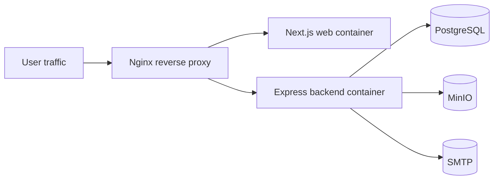

# Deployment Guide

RakshaAI deployment reference for the current repository state.

Source of truth:
- `docker/docker-compose.yml`
- `docker/docker-compose.dev.yml`
- `apps/backend/Dockerfile`
- `apps/web/Dockerfile`
- `apps/backend/src/config/env.ts`

Related docs:
- [ENVIRONMENT.md](ENVIRONMENT.md)
- [ARCHITECTURE.md](ARCHITECTURE.md)
- [RUNBOOK.md](RUNBOOK.md)

## 1. Deployment Overview

RakshaAI currently supports:

- local development via `npm run dev`
- containerized deployment via Docker Compose
- direct Node runtime start for backend and web



## 2. Prerequisites

| Component | Requirement |
|---|---|
| Application runtime | Node.js 18+ for local development; Node 20 in Docker images |
| Database | PostgreSQL 15+ |
| Object storage | MinIO-compatible service |
| Email | SMTP provider |
| Proxy | Nginx or equivalent reverse proxy in production |
| TLS | Required in production |

## 3. Environment Configuration

See [ENVIRONMENT.md](ENVIRONMENT.md) for the full variable list.

Minimum required variables:

- `DATABASE_URL`
- `JWT_ACCESS_SECRET`
- `JWT_REFRESH_SECRET`

### Example local setup

```bash
cp .env.example .env
npm install
npm run db:generate
npm run db:migrate
npm run seed:roles
```

## 4. Database Setup

### Local

The repository expects PostgreSQL to be available before backend startup.

```bash
npm run db:migrate
npm run db:seed
```

### Production

Recommended sequence:

1. Create the PostgreSQL database and user.
2. Set `DATABASE_URL`.
3. Run Prisma migrations with `npm run db:migrate:prod` in the backend workspace.
4. Verify the health endpoint.

## 5. Storage Setup

The backend expects MinIO-style configuration for object storage.

| Variable | Purpose |
|---|---|
| `MINIO_ENDPOINT` | Hostname or IP |
| `MINIO_PORT` | Port |
| `MINIO_ACCESS_KEY` | Access key |
| `MINIO_SECRET_KEY` | Secret key |
| `MINIO_BUCKET_NAME` | Bucket name |
| `MINIO_USE_SSL` | HTTPS toggle |
| `MINIO_APK_OBJECT_KEY` | APK object path |

## 6. SMTP Setup

The backend supports either `EMAIL_*` or `SMTP_*` variable naming.

Recommended steps:

1. Configure a real SMTP provider.
2. Populate sender credentials.
3. Verify outbound mail from the auth and SOS flows.

## 7. Application Build and Start

### Without Docker

Backend:

```bash
npm install
npm run db:generate
npm run db:migrate
npm --workspace=apps/backend run build
npm --workspace=apps/backend run start
```

Web:

```bash
npm --workspace=apps/web run build
npm --workspace=apps/web run start
```

Important: build the web app only after `apps/web/.env.production` or equivalent `NEXT_PUBLIC_*` values are set. Those public env variables are compiled into the Next.js bundle, so changing them later requires a fresh rebuild.

There is no PM2 configuration checked into the repository. If you want PM2, wrap the same `node dist/server.js` and `next start` commands in a local process file.

### With Docker

Build and run:

```bash
docker compose -f docker/docker-compose.yml up --build
```

Production compose currently starts:

- PostgreSQL
- Redis
- backend
- web
- Nginx

Note: Redis is present in compose, but the current application code does not rely on it for core flows.

## 8. Nginx Reverse Proxy

The repository includes a checked-in Nginx reference at `docker/nginx/nginx.conf`. A practical production proxy should:

- forward browser traffic to the web container
- forward `/api` and Socket.IO traffic to the backend
- set `X-Forwarded-*` headers
- terminate TLS

Example skeleton:

```nginx
server {
  listen 443 ssl;
  server_name rakshaai.example.com;

  location /api/ {
    proxy_pass http://backend:5000/api/;
    proxy_set_header Host $host;
    proxy_set_header X-Forwarded-For $proxy_add_x_forwarded_for;
    proxy_set_header X-Forwarded-Proto https;
  }

  location /socket.io/ {
    proxy_pass http://backend:5000/socket.io/;
    proxy_http_version 1.1;
    proxy_set_header Upgrade $http_upgrade;
    proxy_set_header Connection "upgrade";
  }

  location / {
    proxy_pass http://web:3000;
  }
}
```

For the live `raksha.rishit.codes` deployment, the web app should use:

```env
NEXT_PUBLIC_API_URL=https://raksha.rishit.codes/api
NEXT_PUBLIC_WS_URL=https://raksha.rishit.codes
NEXT_PUBLIC_SOCKET_URL=https://raksha.rishit.codes
FRONTEND_URL=https://raksha.rishit.codes
CORS_ORIGIN=https://raksha.rishit.codes
```

## 9. CI/CD

No GitHub Actions workflow is currently checked in.

Recommended baseline:

- build backend
- build web
- run lint
- run tests when present
- run Prisma generate
- verify migrations in a staging environment

## 10. Health Checks and Verification

After deployment verify:

```bash
curl https://your-domain/api/health
```

Expected response:

```json
{
  "status": "ok",
  "service": "rakshaai-backend",
  "timestamp": "...",
  "uptime": 123.45
}
```

Also verify:

- login
- auth refresh
- SOS creation
- Socket.IO connection
- database access
- SMTP delivery

## 11. Updating the Application

Recommended update flow:

1. Pull the new release branch.
2. Build the backend and web images.
3. Apply migrations.
4. Restart services.
5. Verify health and auth.

Rollback guidance:

- keep previous images available
- avoid destructive migrations when possible
- revert application code first if the schema did not change
- revert schema only with a migration-aware plan

## 12. Monitoring and Logs

Observed log paths and signals:

- Winston logs to `logs/`
- Express request logging via Morgan
- container health checks for backend and web

Recommended monitoring:

- alert on backend health failures
- alert on database connectivity failures
- alert on repeated auth failures
- alert on email delivery failures

## 13. Troubleshooting

| Symptom | Likely cause | First check |
|---|---|---|
| Backend will not start | Missing required env var | `apps/backend/src/config/env.ts` |
| Health check fails | Database or runtime issue | `curl /api/health` |
| Login fails | JWT secret, auth issue, or inactive user | backend logs |
| Emails do not send | SMTP misconfiguration | SMTP env vars |
| APK download fails | MinIO credentials or bucket config | MinIO env vars |
