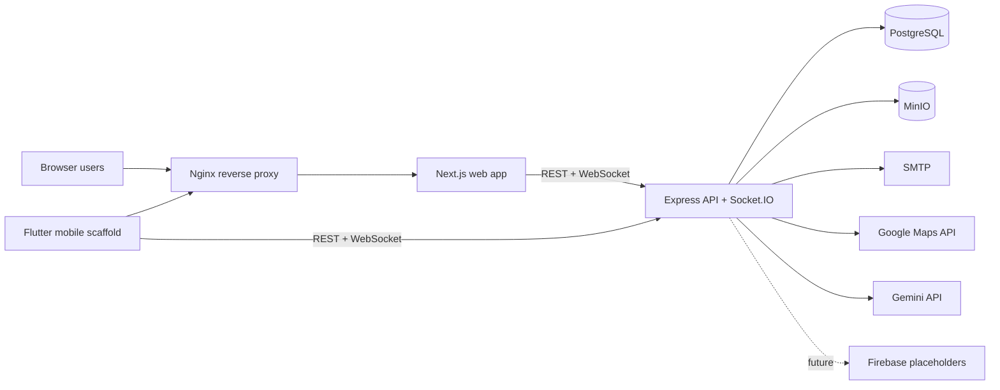
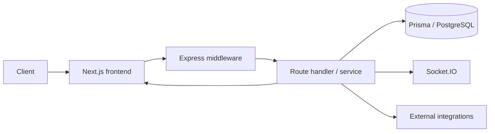

# Technical Requirements Document

RakshaAI

AI-Powered Women Safety and Emergency Response Ecosystem

Source of truth:
- [`AppFlow.md`](./AppFlow.md)
- [`BackendSchema.md`](./BackendSchema.md)
- [`Implementation.md`](./Implementation.md)
- [`PRD.md`](./PRD.md)
- [`API.md`](./API.md)
- [`ARCHITECTURE.md`](./ARCHITECTURE.md)
- [`DEPLOYMENT.md`](./DEPLOYMENT.md)
- [`ENVIRONMENT.md`](./ENVIRONMENT.md)
- [`apps/web/src/app/`](../apps/web/src/app)
- [`apps/backend/src/`](../apps/backend/src)
- [`prisma/schema.prisma`](../prisma/schema.prisma)

Status legend:
- Implemented: present in the current repository and wired into runtime
- Partial: scaffolded, disabled, or only partly connected end to end
- Planned: not yet implemented in the current repository

## 1. System Context

RakshaAI is a safety and emergency-response platform. Its technical purpose is to let a user trigger SOS flows quickly, broadcast live status to responders, and support role-aware operations for police, NGOs, volunteers, and administrators.

### External Systems

- PostgreSQL stores application data.
- SMTP sends OTP, emergency, and alert emails.
- MinIO stores and serves the mobile APK through presigned URLs.
- Google Maps API supports static-map links in email and some location-aware flows.
- Gemini API powers AI chat, classification, and risk analysis.
- Socket.IO provides realtime broadcasts between the browser and backend.
- Nginx is used as the front-door reverse proxy in the Docker deployment.
- Redis appears in Docker Compose only; the application code does not currently use it for caching or queues.
- Firebase env placeholders exist for future push notifications, but no Firebase runtime integration is committed yet.

### System Boundaries

Inside the system:
- Next.js web frontend
- Express API and Socket.IO server
- Prisma ORM and PostgreSQL schema
- email sending, moderation, and audit logging
- MinIO APK download path

Outside the system:
- SMTP provider
- Google Maps
- Gemini
- object storage infrastructure
- TLS termination / reverse proxy
- future queue or push provider

### Technical Constraints

- Node.js 20+ is the runtime baseline in Dockerfiles and setup scripts.
- The backend is TypeScript on Express 4.
- The web app is Next.js 14 App Router.
- Prisma 5.12 is the ORM version in package manifests.
- The primary database is PostgreSQL; the schema enables `uuid-ossp`, `postgis`, and `pg_trgm`.
- The app must continue to function if non-critical integrations fail, especially email and AI.

## 2. Technical Architecture

### Architectural Style

RakshaAI is a monorepo with two active application surfaces:
- a browser client built in Next.js
- a backend API built in Express

The architecture is a modular monolith on the backend rather than microservices. Route groups and services are separated by domain, but they all run in one Node process per backend instance.

### Layer Responsibilities

| Layer | Responsibility | Technology | Rationale |
|---|---|---|---|
| Presentation | UI, browser auth state, dashboards, forms | Next.js 14, React 18, Zustand, React Query | Fast UI iteration and App Router support |
| Transport | REST endpoints, realtime events, auth gates | Express, Socket.IO | Simple operational model with realtime capability |
| Domain | SOS, community, organization, moderation, dashboards | Services and controllers in `apps/backend/src/services` and `controllers` | Keeps business logic separate from routing |
| Validation | Request schema enforcement and input sanitization | Zod middleware, sanitize middleware | Prevents invalid payloads from entering the domain layer |
| Persistence | Data modeling and database access | Prisma + PostgreSQL | Strong schema enforcement and developer productivity |
| Integration | SMTP, MinIO, Maps, Gemini | Nodemailer, MinIO SDK, Google APIs, Gemini SDK | Clear external dependency boundaries |
| Observability | request logs, app logs, error logs | Morgan, Winston | Enough visibility for current deployment size |

### Request Flow

1. Browser or mobile client sends a request to the web app or directly to the API.
2. The frontend attaches the access token from local storage and includes credentials for the refresh cookie.
3. Express applies Helmet, CORS, body parsing, sanitization, compression, and rate limiting.
4. Route middleware enforces authentication and role-based authorization.
5. Zod validators coerce and validate request bodies, params, and query strings.
6. Service code reads or writes through Prisma.
7. The backend emits realtime events over Socket.IO and may call SMTP, MinIO, Google Maps, or Gemini.
8. The response uses a standard JSON envelope.

## 3. Infrastructure Requirements

| Component | Requirement | Current implementation | Configuration location |
|---|---|---|---|
| Application server | Node.js 20+, TypeScript build output, ability to serve REST and Socket.IO, health probe support | Backend runs from `dist/server.js` and listens on port 5000 | `apps/backend/Dockerfile`, `apps/backend/package.json`, `apps/backend/src/server.ts` |
| Web server | Node.js 20+, Next.js standalone output, health probe support | Web runs from Next standalone server on port 3000 | `apps/web/Dockerfile`, `apps/web/package.json` |
| Database server | PostgreSQL 15+ with `uuid-ossp`, `postgis`, and `pg_trgm` | Compose uses PostgreSQL 16-alpine; Prisma schema expects PostgreSQL | `prisma/schema.prisma`, `docker/docker-compose.yml` |
| Storage | Object storage for APK delivery | MinIO serves a presigned APK URL; generic upload flow is not implemented | `apps/backend/src/services/app-download.service.ts`, `apps/backend/src/config/env.ts` |
| SMTP | Outbound email transport for OTP and alert mail | Nodemailer transport with graceful degradation on misconfiguration | `apps/backend/src/config/mailer.ts`, `apps/backend/src/services/email.service.ts` |
| Reverse proxy | TLS termination and single external entry point | Nginx fronts web and backend in compose | `docker/docker-compose.yml` |
| Queue / worker | Not currently required by runtime code | No dedicated queue or worker exists; Redis is only present in compose | `docker/docker-compose.yml` |

Operational notes:
- Baseline sizing guidance for a small production deployment is 2 vCPU and 2 to 4 GB RAM for the backend, 1 to 2 vCPU and 1 to 2 GB RAM for the web frontend, and a separately sized PostgreSQL instance.
- The backend and web services are stateless enough to be containerized independently.
- Postgres is the durable stateful dependency.
- Socket.IO currently runs in-process, so horizontal scaling would require sticky sessions or a shared adapter later.
- There is no PM2 configuration in the repository.

## 4. API Specification

### Common Response Shape

The backend uses a standard envelope:

- Success: `{ success: true, message, data, timestamp }`
- Error: `{ success: false, message, error?, timestamp }`
- Validation failure: `422` with `errors: [{ field, message }]`

### Route Surface

| Area | Methods and paths | Auth | Validation / schema source | Notes |
|---|---|---|---|---|
| Health | `GET /api/health` | Public | None | Used by Docker health checks and local probes |
| Auth | `POST /api/auth/register/send-otp`, `POST /api/auth/register/check-otp`, `POST /api/auth/register/verify-otp`, `POST /api/auth/register`, `POST /api/auth/login`, `POST /api/auth/login-mpin`, `POST /api/auth/refresh`, `POST /api/auth/logout`, `POST /api/auth/setup-mpin`, `POST /api/auth/mpin/setup`, `PUT /api/auth/mpin/change`, `POST /api/auth/change-password`, `DELETE /api/auth/mpin/disable`, `GET /api/auth/me` | Mixed | `apps/backend/src/validators/auth.validator.ts` | Refresh token can come from cookie or body; auth rate limit is applied to login and registration |
| SOS | `POST /api/sos`, `PATCH /api/sos/status`, `GET /api/sos/active`, `GET /api/sos/history`, `GET /api/sos/:id`, `POST /api/sos/:id/cancel` | Authenticated | `apps/backend/src/validators/sos.validator.ts` | Create is lightly rate-limited; SOS is the highest-priority flow |
| Maps | `GET /api/maps/nearby/volunteers`, `GET /api/maps/nearby/police`, `GET /api/maps/nearby/safe-zones`, `GET /api/maps/risk` | Authenticated | Query driven in controllers/services | Route-level rate limiting is enabled |
| Volunteers | `POST /api/volunteers/register`, `GET /api/volunteers/profile`, `PATCH /api/volunteers/availability`, `POST /api/volunteers/accept`, `GET /api/volunteers/alerts` | Authenticated; role checks on action routes | `apps/backend/src/validators/volunteer.validator.ts` | Self-registration exists but still runs through an authenticated router |
| Police | `POST /api/police/register`, `GET /api/police/profile`, `PATCH /api/police/duty`, `POST /api/police/assign`, `POST /api/police/escalate`, `GET /api/police/alerts` | Authenticated; role checks on action routes | `apps/backend/src/validators/police.validator.ts` | Similar managed onboarding pattern to volunteers |
| AI | `POST /api/ai/classify`, `POST /api/ai/risk-analysis`, `POST /api/ai/chat` | Authenticated | `apps/backend/src/validators/ai.validator.ts` | AI rate limiter is separate from the global limiter |
| Community | `GET /api/community`, `GET /api/community/heatmap`, `POST /api/community`, `POST /api/community/upvote`, `POST /api/community/comments` | Public read, authenticated write | `apps/backend/src/validators/community.validator.ts` | Create path is rate-limited |
| Incidents | `GET /api/incidents`, `POST /api/incidents/:id/like`, `POST /api/incidents/:id/comments` | Read is public, write is authenticated | `apps/backend/src/validators/community.validator.ts` | Community incident feed uses a simpler public surface |
| Emergency contacts | `GET /api/emergency-contacts`, `POST /api/emergency-contacts`, `PUT /api/emergency-contacts/:id`, `DELETE /api/emergency-contacts/:id`, `PATCH /api/emergency-contacts/:id/primary` | Authenticated | `apps/backend/src/validators/emergency-contact.validator.ts` | User-scoped CRUD |
| App download | `GET /api/app/download` | Public | None | Returns a presigned MinIO URL or `503` if storage is unavailable |
| Hotspots | `POST /api/hotspots/:hotspotId/assign` | Authenticated | `apps/backend/src/validators/hotspot.validator.ts` | Used by police assignment flows |
| Organizations | `POST /api/organizations`, `GET /api/organizations`, `GET /api/organizations/:id`, `PATCH /api/organizations/:id/approve`, `PATCH /api/organizations/:id/suspend`, `POST /api/organizations/workers`, `GET /api/organizations/:orgId/workers`, `PATCH /api/organizations/workers/:id/deactivate` | Authenticated; role-restricted | `apps/backend/src/controllers/organization.controller.ts` and service layer | Organization admin and super admin management surface |
| Admin | `GET /api/admin/navigation-meta`, `GET /api/admin/overview`, `GET /api/admin/users`, `PATCH /api/admin/users/:id/role`, `PATCH /api/admin/users/:id/suspend`, `DELETE /api/admin/users/:id`, `GET /api/admin/check-email`, `GET /api/admin/departments`, `POST /api/admin/departments`, `DELETE /api/admin/departments/:id`, `GET /api/admin/ngos`, `POST /api/admin/ngos`, `DELETE /api/admin/ngos/:id`, `GET /api/admin/hotspots`, `GET /api/admin/hotspots/:id`, `PATCH /api/admin/hotspots/:id/status`, `GET /api/admin/analytics/sos`, `GET /api/admin/moderation/queue`, `POST /api/admin/moderation/:id/dismiss`, `DELETE /api/admin/moderation/incident/:id`, `DELETE /api/admin/moderation/comment/:id`, `PATCH /api/admin/moderation/user/:id/ban`, `GET /api/admin/audit-log` | Super admin only | `apps/backend/src/validators/admin.validator.ts`, hierarchy validators | Highest-privilege management surface |
| Department | `GET /api/department/navigation-meta`, `GET /api/department/overview`, `GET /api/department/policemen`, `POST /api/department/policemen`, `GET /api/department/policemen/:id`, `PATCH /api/department/policemen/:id/deactivate`, `PATCH /api/department/policemen/:id/reactivate`, `GET /api/department/hotspots`, `POST /api/department/hotspots`, `POST /api/department/hotspots/:id/assign`, `DELETE /api/department/hotspots/:id/assign`, `PATCH /api/department/hotspots/:id`, `DELETE /api/department/hotspots/:id`, `GET /api/department/incidents`, `PATCH /api/department/incidents/:id/resolve`, `GET /api/department/sos`, `PATCH /api/department/sos/:id/acknowledge`, `PATCH /api/department/sos/:id/resolve`, `GET /api/department/zones`, `POST /api/department/zones`, `PATCH /api/department/zones/:id`, `DELETE /api/department/zones/:id`, `GET /api/department/activity` | Police department only | `apps/backend/src/validators/department.validator.ts` | Jurisdictional response and operations surface |
| NGO | `GET /api/ngo/navigation-meta`, `GET /api/ngo/overview`, `GET /api/ngo/volunteers`, `POST /api/ngo/volunteers`, `GET /api/ngo/volunteers/:id`, `PATCH /api/ngo/volunteers/:id/deactivate`, `PATCH /api/ngo/volunteers/:id/reactivate`, `GET /api/ngo/incidents`, `GET /api/ngo/incidents/assigned`, `POST /api/ngo/incidents/:id/assign`, `DELETE /api/ngo/incidents/:id/assign`, `PATCH /api/ngo/incidents/:id/close`, `GET /api/ngo/sos`, `PATCH /api/ngo/sos/:id/respond`, `PATCH /api/ngo/sos/:id/close`, `GET /api/ngo/zones`, `GET /api/ngo/activity` | NGO only | `apps/backend/src/validators/ngo.validator.ts` | Volunteer operations and assigned incident handling |
| Dashboard | `GET /api/dashboard/superadmin/overview`, `GET /api/dashboard/superadmin/users`, `PATCH /api/dashboard/superadmin/users/:id/status`, `GET /api/dashboard/superadmin/moderation`, `GET /api/dashboard/superadmin/hotspots`, `GET /api/dashboard/superadmin/analytics`, `GET /api/dashboard/superadmin/audit`, `GET /api/dashboard/department/overview`, `GET /api/dashboard/department/assignments`, `GET /api/dashboard/department/activity`, `GET /api/dashboard/ngo/overview`, `GET /api/dashboard/ngo/response`, `GET /api/dashboard/ngo/activity`, `GET /api/dashboard/policeman/overview`, `GET /api/dashboard/policeman/hotspot`, `POST /api/dashboard/policeman/report`, `GET /api/dashboard/volunteer/overview`, `GET /api/dashboard/volunteer/cases`, `POST /api/dashboard/volunteer/check-in` | Role-specific | Mixed validators | Web dashboard summary endpoints mirroring the UI shells |
| Zones | `POST /api/zones/create`, `GET /api/zones`, `PUT /api/zones/:id`, `DELETE /api/zones/:id` | Authenticated; department or admin checks for mutating routes | `apps/backend/src/validators/zone.validator.ts` | Shared zone management path |
| Red zones | `POST /api/redzones/trigger` | Authenticated | `apps/backend/src/validators/redzone.validator.ts` | Triggers red-zone notification logic |
| Officer | `GET /api/officer/navigation-meta`, `GET /api/officer/overview`, `GET /api/officer/hotspot`, `GET /api/officer/sos`, `PATCH /api/officer/sos/:id/acknowledge`, `PATCH /api/officer/sos/:id/resolve`, `GET /api/officer/incidents`, `PATCH /api/officer/incidents/:id/resolve`, `POST /api/officer/incidents` | Policeman only | `apps/backend/src/validators/officer.validator.ts` | Operational officer console |

Common error codes across the API:
- `400` invalid business input
- `401` missing, invalid, or expired credentials
- `403` valid auth but insufficient role
- `404` resource not found
- `409` conflict, such as duplicate identity
- `422` schema validation failure
- `429` rate limit exceeded
- `500` unexpected server error
- `503` downstream dependency unavailable, used for APK download fallback

## 5. Data Requirements

- Database engine: PostgreSQL 15+.
- Current container image: PostgreSQL 16-alpine.
- ORM: Prisma 5.12.
- Schema file: `prisma/schema.prisma`.
- Database extensions enabled in Prisma: `uuid-ossp`, `postgis`, and `pg_trgm`.

Data validation and integrity layers:
- Zod validators run at the route layer.
- `sanitizeBody` strips script tags, HTML tags, null bytes, and obvious SQL-like fragments from string payloads.
- Prisma schema constraints enforce uniqueness and relations.
- Passwords, MPINs, OTPs, and refresh tokens are hashed before persistence.
- Refresh sessions are stored in `UserSession` and rotated on refresh.

Retention and backup:
- The repository does not define a backup job or archive policy.
- No retention cron or cleanup worker is committed.
- Seed data is idempotent in intent, but seeding is a bootstrap task, not a production retention mechanism.

Migration strategy:
- Migrations live in `prisma/migrations`.
- Runtime startup in backend Docker and the backend `start` script runs `prisma migrate deploy`.
- Development uses `prisma migrate dev`.

Operational implication:
- Database changes must be treated as first-class deployment work.
- Destructive migrations should be avoided unless a rollback plan and backup exist.

## 6. Security Requirements

### Authentication

- Access tokens are JWTs signed with `JWT_ACCESS_SECRET`.
- Refresh tokens are JWTs signed with `JWT_REFRESH_SECRET`.
- Access tokens default to 15 minutes.
- Refresh tokens default to 7 days.
- Refresh tokens are stored as HttpOnly, `SameSite=Strict` cookies under `/api/auth`.
- The frontend also mirrors the access token in local storage for API calls.
- Backend sessions are tracked in `UserSession` and hashed with bcrypt.

### Authorization

- The backend uses middleware gates such as `authenticate`, `authorize`, `requireSuperAdmin`, `requirePoliceDepartment`, `requireNgo`, `requirePoliceman`, and `requireVolunteer`.
- The frontend has route guards and role-based dashboard navigation, but backend enforcement is the real security boundary.
- Legacy role names still exist in the schema and some middleware checks; this is a compatibility constraint.

### Input Validation

- Zod validation is applied to request bodies, params, and queries.
- Validation failures return HTTP 422 with a field-level error list.
- Request bodies are sanitized before handler execution.

### File and Storage Security

- There is no general file upload feature currently wired end to end.
- MinIO is used only to verify and presign the APK object for download.
- The presigned URL is short lived, currently 60 seconds.

### Secret and Environment Management

- Required env vars are enforced at backend startup for `DATABASE_URL`, `JWT_ACCESS_SECRET`, and `JWT_REFRESH_SECRET`.
- Other integrations degrade gracefully if optional env vars are missing.
- Secrets are expected to come from environment files or deployment secrets, not from committed code.

### Transport Security

- HTTPS is not enforced in application code.
- TLS termination is expected at the reverse proxy or platform layer.
- The CORS policy is allowlist based and credentials-enabled.

### Abuse Prevention

- Global API rate limiting is enabled.
- Auth endpoints have a stricter limiter.
- AI endpoints have a separate limiter.
- SOS creation uses the auth limiter to reduce abuse.
- Request bodies are capped at 1 MB.

### Known Security Gaps

- No MFA is implemented.
- No CSRF token flow exists; the current design relies on bearer auth plus a strict refresh cookie.
- No CAPTCHA or device reputation system is present.
- No centralized secrets vault is committed.

## 7. Performance Requirements

Current implementation characteristics:
- No formal p95/p99 telemetry is committed.
- Prisma query logging is enabled in development only.
- Compression is enabled at the HTTP layer.
- The backend is intentionally optimized so SOS creation does not depend on non-critical side effects.

Recommended performance targets for the current architecture:
- `GET /api/health`: under 100 ms in normal conditions.
- Auth and profile reads: under 500 ms p95 excluding network latency.
- SOS creation: under 1 second p95 excluding email delivery.
- Socket broadcasts: near real time after persistence, ideally under 100 ms from event emission.
- APK URL generation: under 500 ms unless MinIO is slow.
- AI calls: best-effort, with latency dominated by the external provider.

Known performance bottlenecks:
- synchronous email calls
- dashboard queries with large joins / counts
- realtime fan-out when many sockets subscribe to the same alert
- public map and community aggregation queries

## 8. Scalability Requirements

- Current scaling model: vertical scaling first, horizontal scaling later.
- Stateless parts: web frontend and most backend request handlers.
- Stateful parts: PostgreSQL, MinIO, and in-process Socket.IO rooms.
- Database scaling: no replicas or sharding strategy is configured.
- Storage scaling: depends on MinIO or the underlying object store deployment.
- Queue scaling: not applicable yet because no queue worker exists.

Known bottlenecks:
- Socket.IO in-process broadcasting will need a shared adapter for multi-instance backend scaling.
- The backend currently sends some notifications inline rather than through a queue.
- PostgreSQL is the primary scaling ceiling for write-heavy paths.

## 9. Reliability and Availability Requirements

- There is no formal SLO committed in the repository; the operational expectation is that critical SOS paths stay available even when optional integrations fail.
- The health endpoint is available at `GET /api/health`.
- Docker and Compose health checks target the backend health endpoint.
- The backend handles `SIGTERM` and `SIGINT` by closing the HTTP server and disconnecting Prisma.
- Unhandled promise rejections and uncaught exceptions are logged.

Failure handling:
- Email failure is logged and does not block SOS creation.
- MinIO failure returns `503` from the download endpoint.
- Invalid or expired JWTs return `401`.
- Unauthorized role access returns `403`.
- Validation failures return `422`.
- Not found routes return `404`.

Recommended availability target:
- Phase 1 target should be at least 99.5 percent for the API service, excluding planned maintenance.

## 10. Deployment Requirements

### Target Runtime

- Linux containers are the primary deployment target.
- Backend container base image: `node:20-alpine`.
- Web container base image: `node:20-alpine`.

### Containerization

- Backend Dockerfile builds TypeScript, copies Prisma artifacts, exposes port 5000, and includes a health check.
- Web Dockerfile builds a Next standalone server, exposes port 3000, and includes a health check.
- `docker/docker-compose.yml` wires Postgres, Redis, backend, web, and Nginx.
- `docker/docker-compose.dev.yml` supports local Windows development with Redis and pgAdmin.

### PM2

- PM2 is not used in the current repository.
- If process supervision is needed outside containers, it should be introduced explicitly rather than assumed.

### Environment Management

- `apps/backend/.env.example`, `apps/web/.env.example`, and the root `.env.example` document expected values.
- The backend accepts both `EMAIL_*` and `SMTP_*` aliases.
- Required variables must be present before startup.

### Deployment Procedure

1. Provision PostgreSQL, MinIO, and SMTP credentials.
2. Set backend and web environment variables.
3. Run Prisma generate and migration deploy.
4. Build backend and web artifacts.
5. Start the backend and web containers or run the Node services directly.
6. Place Nginx or another reverse proxy in front of the services.
7. Verify `GET /api/health` and the web homepage.

### Rollback

- Roll back by redeploying a previous image or build artifact.
- Prisma migrations are not automatically reversible from the app.
- Backups should exist before destructive schema changes are deployed.

### Zero Downtime Considerations

- The backend can be scaled behind a proxy if sessions and sockets are handled carefully.
- Socket.IO may require sticky sessions or a shared adapter in a multi-instance setup.
- Database migrations should be backwards compatible where possible.

## 11. Observability Requirements

### Current Implementation

- Winston logs to console and to files in production mode.
- Morgan records HTTP requests.
- Prisma logs queries in development only.
- Runtime errors are captured by a central error handler and logged.
- Exception and rejection handlers write to separate Winston files.

### Gaps

- No metrics backend is committed.
- No distributed tracing is committed.
- No structured alerting pipeline is committed.
- No queue observability is needed yet because there is no queue.

### Recommended Tooling

- OpenTelemetry for traces
- Prometheus and Grafana for metrics
- Sentry or similar for frontend and backend error reporting
- Log aggregation for `logs/combined.log` and `logs/error.log`

## 12. Integration Requirements

| Integration | Purpose | Protocol | Configuration | Failure handling | Notes |
|---|---|---|---|---|---|
| PostgreSQL | Persistent system of record | SQL | `DATABASE_URL` | Startup should fail if missing; runtime errors become 500s | Primary data store |
| SMTP | OTP and alert emails | SMTP | `EMAIL_*` or `SMTP_*` env vars | Email failures are logged; some flows continue | Direct send, no queue |
| MinIO | APK download storage | S3-like object API | `MINIO_*` env vars | Download endpoint returns 503 if unavailable | Only APK delivery is implemented |
| Google Maps | Static map links and map context | HTTPS REST | `GOOGLE_MAPS_API_KEY` | Optional; null behavior if absent | Currently used in email helpers |
| Gemini | AI chat and analysis | HTTPS REST | `GEMINI_API_KEY` | Requests fail gracefully when unavailable | Authenticated AI endpoints only |
| Socket.IO | Realtime broadcasts | WebSocket / polling | `NEXT_PUBLIC_WS_URL`, backend socket setup | Client reconnect behavior is browser-side | In-process only right now |
| Firebase | Future push notifications | Not yet wired | `FIREBASE_SERVER_KEY`, `FIREBASE_PROJECT_ID` | No current runtime dependency | Placeholder integration |
| Nginx | Reverse proxy | HTTP | Docker compose config | Proxy failure takes down the front door | Not a code dependency |

## 13. Testing Requirements

Current state:
- The repository does not contain committed unit or integration tests under the main apps.
- Backend `npm test` is configured with `--passWithNoTests`.
- No GitHub Actions workflow is committed.

Technical requirements for the next stage:
- Add unit tests for auth, SOS, and role enforcement.
- Add integration tests for route validation and Prisma writes.
- Add at least one end-to-end test for the login and SOS path.
- Add CI that runs lint, build, and tests on pull requests.

## 14. Technical Constraints and Assumptions

### Hard Constraints

- TypeScript is the implementation language for backend and web.
- Express remains the backend framework.
- Next.js remains the web framework.
- Prisma remains the ORM.
- PostgreSQL remains the primary datastore.
- JWT remains the auth mechanism.
- Socket.IO remains the realtime transport.

### Assumptions

- TLS is handled by the deployment environment.
- SMTP credentials are provided in production.
- MinIO or a compatible object store is available for APK delivery.
- Optional AI and Maps APIs may be disabled in some deployments without breaking the core SOS path.

### Accepted Limitations

- No dedicated queue or worker service exists.
- No PM2 deployment exists.
- No CI/CD workflow exists in the repository.
- No generic file upload product surface exists yet.
- Redis is present in compose but unused by the application code.

## 15. Architecture Decision Records

| Decision | Status | Context | Decision | Consequences |
|---|---|---|---|---|
| Monorepo layout | Accepted | Web, backend, and shared docs need to evolve together | Keep apps under one repository with shared root tooling | Simpler handoff, but repo-wide changes can touch multiple apps |
| Next.js web frontend | Accepted | The product needs a rich browser UI and fast route-based navigation | Use Next.js 14 App Router for the web client | Good DX and SSR support, but adds framework-specific conventions |
| Express backend | Accepted | The platform needs a straightforward, inspectable API layer | Use Express 4 with TypeScript | Easy to reason about, but less opinionated than some alternatives |
| PostgreSQL + Prisma | Accepted | The app needs relational integrity and typed data access | Use PostgreSQL with Prisma 5.12 | Strong schema support and fast development, with migration discipline required |
| JWT auth + refresh sessions | Accepted | The app needs short-lived access tokens and resumable sessions | Use JWT access tokens, hashed refresh-token sessions, and cookie refresh | Good UX and stateless requests, but session revocation must be managed explicitly |
| Socket.IO realtime | Accepted | SOS and responder coordination need live updates | Use Socket.IO over HTTP/WebSocket | Easier client support than raw WS, but scaling needs extra care |
| MinIO for APK delivery | Accepted | The app needs object storage for binary distribution | Store the APK in object storage and serve a presigned URL | Simple and secure, but only the APK flow is implemented now |
| Direct SMTP emails | Accepted | OTP and alert emails must work without extra infrastructure | Send emails inline through Nodemailer | Low complexity, but delivery failures are not queued for retry |
| Inline side effects instead of a queue | Accepted | The current platform favors simplicity and fast delivery | Keep notification and audit side effects fire-and-forget or inline | Fewer moving parts, but weaker delivery guarantees than a worker queue |
| Docker-compose deployment | Accepted | The repo needs a reproducible local and container story | Use Dockerfiles plus Compose for backend, web, DB, and proxy | Easy local parity, but orchestration remains simple rather than fully managed |
| No PM2 | Accepted | The current deployment model is container-first | Do not add PM2 as a required runtime layer | Fewer moving parts, but non-container deployments need a different process manager |

## 16. Summary

RakshaAI currently implements:
- a Node 20 and TypeScript backend
- a Next.js 14 web app
- Prisma-backed PostgreSQL persistence
- JWT auth with refresh sessions
- realtime SOS coordination
- direct SMTP and MinIO integrations
- role-based operational dashboards

The main gaps are operational rather than conceptual:
- no queue or worker layer
- no PM2 or CI/CD configuration
- no committed test suite
- no fully implemented upload or push-notification pipeline

Treat this document as the current technical baseline, and use `AppFlow.md`, `BackendSchema.md`, `Implementation.md`, and `PRD.md` for cross-functional context.
