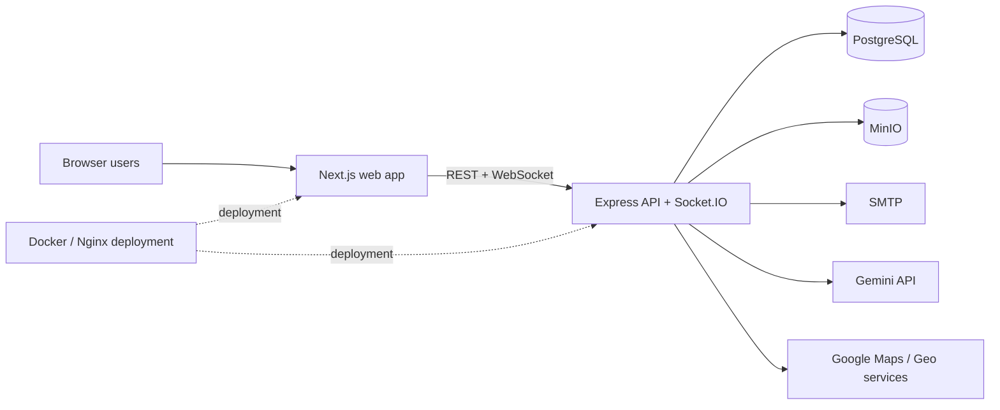
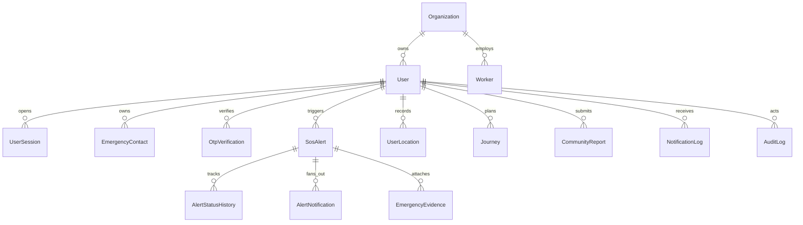
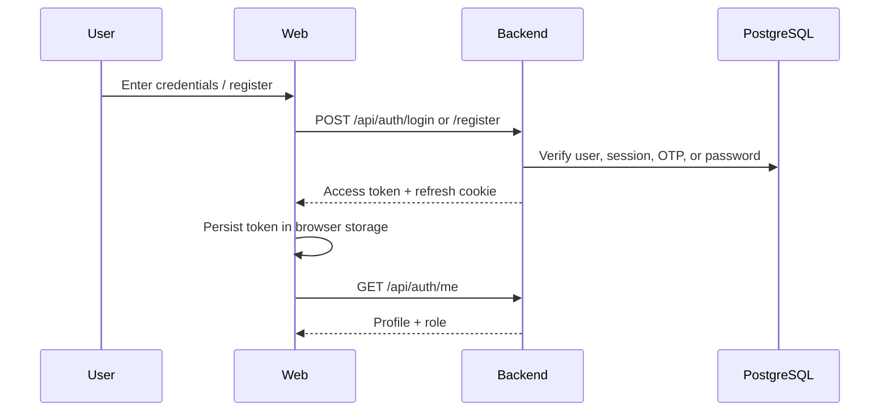
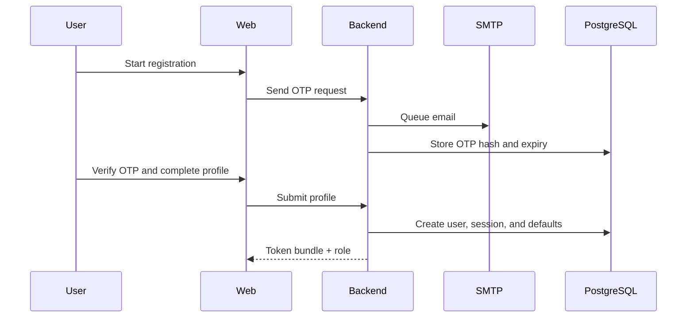
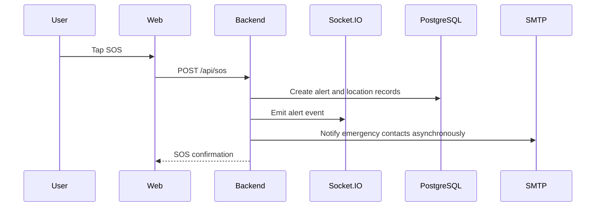

# RakshaAI

RakshaAI is a women safety and emergency assistance platform built as a monorepo. The repository combines a Next.js web experience, an Express + TypeScript backend, Prisma/PostgreSQL persistence, Socket.IO realtime updates, email notifications, and safety-first workflows such as SOS activation, responder coordination, community reporting, and AI assistance.

This README is the project handbook for engineers joining the codebase. It explains what exists today, how the system fits together, and where to find the detailed docs.

Related documentation:
- [docs/AppFlow.md](docs/AppFlow.md)
- [docs/BackendSchema.md](docs/BackendSchema.md)
- [docs/Implementation.md](docs/Implementation.md)
- [docs/PRD.md](docs/PRD.md)
- [docs/TRD.md](docs/TRD.md)
- [docs/UIUX.md](docs/UIUX.md)
- [docs/API.md](docs/API.md)
- [docs/ARCHITECTURE.md](docs/ARCHITECTURE.md)
- [docs/DEPLOYMENT.md](docs/DEPLOYMENT.md)
- [docs/ENVIRONMENT.md](docs/ENVIRONMENT.md)
- [docs/GLOSSARY.md](docs/GLOSSARY.md)
- [docs/RUNBOOK.md](docs/RUNBOOK.md)
- [docs/TESTING.md](docs/TESTING.md)

## What This Product Solves

RakshaAI reduces the time between danger and assistance. It does this by combining:

- rapid SOS activation
- live responder coordination
- emergency contact escalation
- map-based situational awareness
- community incident reporting
- role-based operational dashboards
- AI-assisted triage and guidance

The product is intentionally optimized for panic conditions:

- primary actions are large and obvious
- location capture is opportunistic but not blocking
- non-critical async work never blocks alert confirmation
- status updates propagate in realtime

## System Overview

The current repository is centered on the web and backend stack:

- `apps/web` provides the public site, auth screens, safety tools, and operational dashboards.
- `apps/backend` provides auth, alerts, maps, community, organizations, dashboards, AI, and realtime sockets.
- `prisma` defines the database schema and seed data.
- `apps/mobile` is a Flutter scaffold that mirrors some platform concepts but is not the primary active surface today.

### Annotated Source Tree

```text
.
├── apps
│   ├── backend        Express API, Socket.IO, services, middleware, validation
│   ├── web            Next.js App Router UI, shared components, hooks, stores
│   └── mobile         Flutter scaffold and design token work
├── prisma             Prisma schema, migrations, and seed data
├── scripts            Local setup and helper scripts
├── database           Supplemental database notes and assets
├── docker             Compose files and container runtime support
├── docs               Canonical handbooks and references
├── logs               Runtime log output location
├── packages           Shared package area
└── README.md          This handbook
```

### Boundary Rules

- Backend code owns validation, authorization, and persistence.
- Web code owns rendering, client state, and user interaction.
- Prisma owns model definitions and migration history.
- Docs explain the codebase; they do not define runtime behavior.
- Mobile is present, but the current product experience is web-first.

## Architecture Snapshot

RakshaAI is a modular monorepo with a monolithic backend service and a browser client.



## Major Data Model

The Prisma schema models users, sessions, alerts, emergency contacts, locations, journeys, community reports, organizations, responders, and audit records.



For the full schema, see [docs/BackendSchema.md](docs/BackendSchema.md).

## Core Sequences

### Authentication



### First-Time Provisioning



### SOS Activation



## Quick Start

### Prerequisites

- Node.js 18+
- npm 9+
- PostgreSQL 15+
- Optional: Docker Desktop for compose-based local setup

### Setup

```bash
git clone <repo-url>
cd Women-Safety-Emergency-Assistance-Platform
npm install
```

Create a local `.env` from `.env.example`, then:

```bash
npm run db:generate
npm run db:migrate
npm run seed:roles
npm run dev
```

### Common Commands

```bash
npm run dev          # backend + web
npm run build        # build backend + web
npm run test         # run workspace tests if present
npm run lint         # lint workspace packages
```

## Runtime Metrics

| Metric | Current count |
|---|---:|
| Web routes (`page.tsx`) | 52 |
| Backend API endpoints | 171 |
| Prisma models | 35 |
| Prisma enums | 20 |
| Server actions | 0 |
| Dedicated cron jobs | 0 |
| Primary web roles | 6 |

## Operational Notes

- The backend exposes a health endpoint at `/api/health`.
- Auth uses JWT access tokens plus refresh-token cookies.
- Realtime updates use Socket.IO.
- Email delivery is SMTP-based and should be treated as a non-blocking integration.
- The codebase includes Docker Compose files for local development and production-style deployment.

## Architecture Decisions

### Backend Framework

- Context: the product needs structured business logic, REST, and realtime support.
- Decision: use Express + Socket.IO in a single backend service.
- Consequence: simpler deployment and debugging, with deliberate separation via controllers and services instead of microservices.

### Database

- Context: the domain is relational and heavily stateful.
- Decision: use PostgreSQL with Prisma migrations.
- Consequence: strong consistency and good support for the alert, audit, and organization relationships.

### Auth

- Context: emergency workflows need fast session restoration and role-aware redirects.
- Decision: use JWT access tokens, refresh-token cookies, and browser session persistence.
- Consequence: the client can restore sessions quickly, but token handling must stay disciplined.

### Realtime

- Context: SOS state changes must appear immediately to responders.
- Decision: use Socket.IO rooms and event broadcasts.
- Consequence: operational teams see live alert transitions without polling-heavy UX.

### Storage

- Context: the app needs object storage for APK delivery and future media.
- Decision: use MinIO-compatible object storage.
- Consequence: deployers need object storage credentials and bucket configuration.

## Monitoring and Observability

Current signals:

- server logs via Winston
- request logs via Express middleware
- health endpoint checks
- Socket.IO connection lifecycle

Recommended improvements:

- structured request IDs end to end
- centralized error tracking
- metrics for SOS latency, auth failures, and queue depth
- alerting on email failure and storage failure

## Risk Matrix

| Risk | Impact | Likelihood | Mitigation |
|---|---|---|---|
| Database failure | High | Medium | Backups, health checks, fail-fast startup validation |
| SMTP outage | Medium | Medium | Treat email as async and non-blocking, retry jobs |
| Storage outage | Medium | Low/Medium | Keep storage isolated and surface clear user errors |
| Auth outage | High | Medium | Harden refresh and session persistence paths |
| Deployment failure | High | Medium | Build verification, migration discipline, rollback plan |

## Technical Debt Register

- Some flows are scaffolded more than fully productized on the mobile side.
- There is no global toast system or advanced dialog framework in the web UI.
- Some documentation still reflects a broader future product vision, so code should remain the final source of truth.
- No first-party automated test suite is currently committed in the repository.

